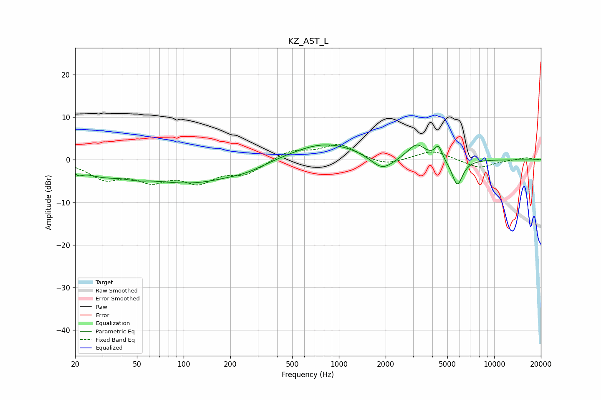

# KZ_AST_L
See [usage instructions](https://github.com/jaakkopasanen/AutoEq#usage) for more options and info.

### Parametric EQs
Apply preamp of -3.6 dB when using parametric equalizer.

|   # | Type    |   Fc (Hz) |    Q |   Gain (dB) |
|-----|---------|-----------|------|-------------|
|   1 | Peaking |        21 | 5.15 |        -1.3 |
|   2 | Peaking |        29 | 1.07 |        -2.3 |
|   3 | Peaking |        50 | 2.31 |        -0.7 |
|   4 | Peaking |       112 | 0.43 |        -5.4 |
|   5 | Peaking |       258 | 1.44 |        -0.7 |
|   6 | Peaking |       807 | 0.62 |         4.3 |
|   7 | Peaking |      1902 | 1.88 |        -3.6 |
|   8 | Peaking |      3170 | 2.47 |         3.6 |
|   9 | Peaking |      4375 | 6    |         3.1 |
|  10 | Peaking |      5789 | 3.93 |        -6.3 |

### Fixed Band EQs
When using fixed band (also called graphic) equalizer, apply preamp of **-3.7 dB** (if available) and set gains manually with these parameters.

|   # | Type    |   Fc (Hz) |    Q |   Gain (dB) |
|-----|---------|-----------|------|-------------|
|   1 | Peaking |        31 | 1.41 |        -4   |
|   2 | Peaking |        62 | 1.41 |        -4.1 |
|   3 | Peaking |       125 | 1.41 |        -4.6 |
|   4 | Peaking |       250 | 1.41 |        -3   |
|   5 | Peaking |       500 | 1.41 |         2.2 |
|   6 | Peaking |      1000 | 1.41 |         3.5 |
|   7 | Peaking |      2000 | 1.41 |        -1.5 |
|   8 | Peaking |      4000 | 1.41 |         2.3 |
|   9 | Peaking |      8000 | 1.41 |        -2   |
|  10 | Peaking |     16000 | 1.41 |         0.5 |

### Graphs

