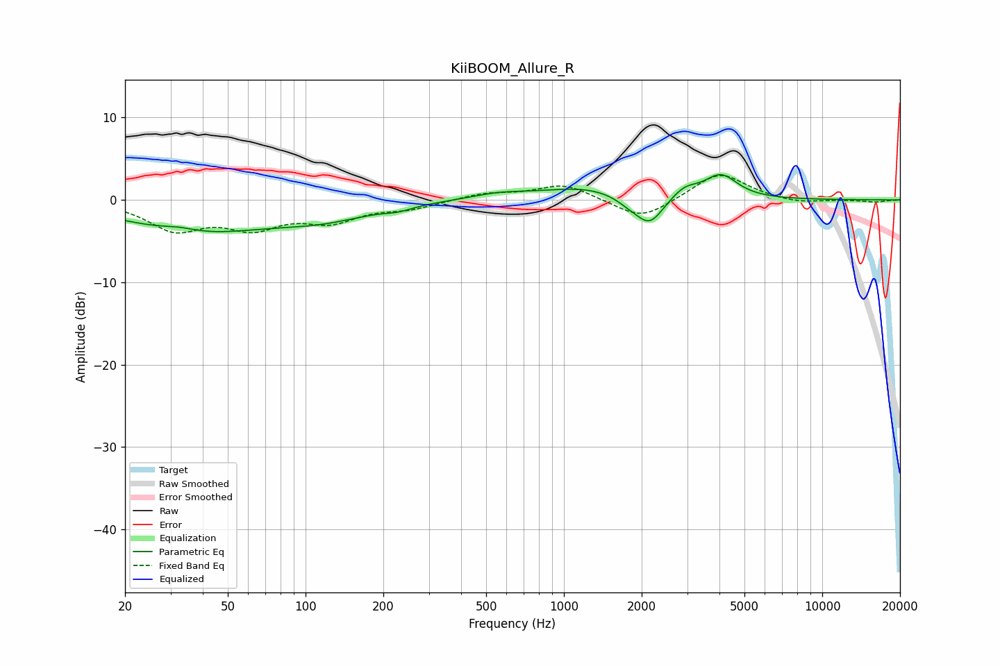

# KiiBOOM_Allure_R
See [usage instructions](https://github.com/jaakkopasanen/AutoEq#usage) for more options and info.

### Parametric EQs
Apply preamp of -3.2 dB when using parametric equalizer.

|   # | Type    |   Fc (Hz) |    Q |   Gain (dB) |
|-----|---------|-----------|------|-------------|
|   1 | Peaking |        32 | 2.1  |         0.5 |
|   2 | Peaking |        37 | 0.51 |        -3.7 |
|   3 | Peaking |       116 | 0.73 |        -1.8 |
|   4 | Peaking |       228 | 2.75 |        -0.4 |
|   5 | Peaking |       559 | 1.29 |         0.7 |
|   6 | Peaking |      1207 | 0.83 |         1.5 |
|   7 | Peaking |      1780 | 2.78 |        -0.7 |
|   8 | Peaking |      2145 | 2.62 |        -3.5 |
|   9 | Peaking |      2934 | 2.84 |         1.2 |
|  10 | Peaking |      4051 | 2.2  |         2.9 |

### Fixed Band EQs
When using fixed band (also called graphic) equalizer, apply preamp of **-3.1 dB** (if available) and set gains manually with these parameters.

|   # | Type    |   Fc (Hz) |    Q |   Gain (dB) |
|-----|---------|-----------|------|-------------|
|   1 | Peaking |        31 | 1.41 |        -3.4 |
|   2 | Peaking |        62 | 1.41 |        -2.9 |
|   3 | Peaking |       125 | 1.41 |        -2.3 |
|   4 | Peaking |       250 | 1.41 |        -0.9 |
|   5 | Peaking |       500 | 1.41 |         0.8 |
|   6 | Peaking |      1000 | 1.41 |         1.9 |
|   7 | Peaking |      2000 | 1.41 |        -2.5 |
|   8 | Peaking |      4000 | 1.41 |         3.4 |
|   9 | Peaking |      8000 | 1.41 |        -0.5 |
|  10 | Peaking |     16000 | 1.41 |        -0.3 |

### Graphs

