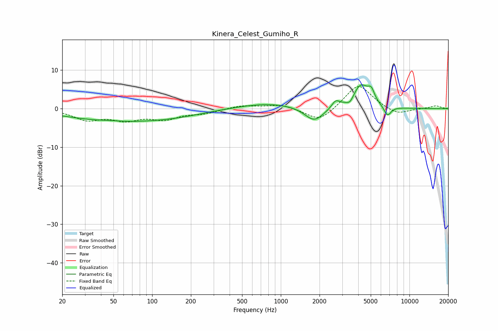

# Kinera_Celest_Gumiho_R
See [usage instructions](https://github.com/jaakkopasanen/AutoEq#usage) for more options and info.

### Parametric EQs
Apply preamp of -6.3 dB when using parametric equalizer.

|   # | Type    |   Fc (Hz) |    Q |   Gain (dB) |
|-----|---------|-----------|------|-------------|
|   1 | Peaking |        47 | 1.89 |         0.2 |
|   2 | Peaking |        50 | 0.38 |        -3   |
|   3 | Peaking |       155 | 0.55 |        -1.2 |
|   4 | Peaking |       807 | 0.56 |         1.5 |
|   5 | Peaking |      1818 | 1.88 |        -3.8 |
|   6 | Peaking |      2667 | 4.66 |         1.8 |
|   7 | Peaking |      3453 | 5.53 |        -1.4 |
|   8 | Peaking |      4189 | 2.23 |         6   |
|   9 | Peaking |      5046 | 5.44 |         2.7 |
|  10 | Peaking |      6751 | 4.89 |        -2.6 |

### Fixed Band EQs
When using fixed band (also called graphic) equalizer, apply preamp of **-5.8 dB** (if available) and set gains manually with these parameters.

|   # | Type    |   Fc (Hz) |    Q |   Gain (dB) |
|-----|---------|-----------|------|-------------|
|   1 | Peaking |        31 | 1.41 |        -2.7 |
|   2 | Peaking |        62 | 1.41 |        -2.5 |
|   3 | Peaking |       125 | 1.41 |        -2.4 |
|   4 | Peaking |       250 | 1.41 |        -1.1 |
|   5 | Peaking |       500 | 1.41 |         0.9 |
|   6 | Peaking |      1000 | 1.41 |         1.1 |
|   7 | Peaking |      2000 | 1.41 |        -3.6 |
|   8 | Peaking |      4000 | 1.41 |         6.6 |
|   9 | Peaking |      8000 | 1.41 |        -1.8 |
|  10 | Peaking |     16000 | 1.41 |         0.7 |

### Graphs

