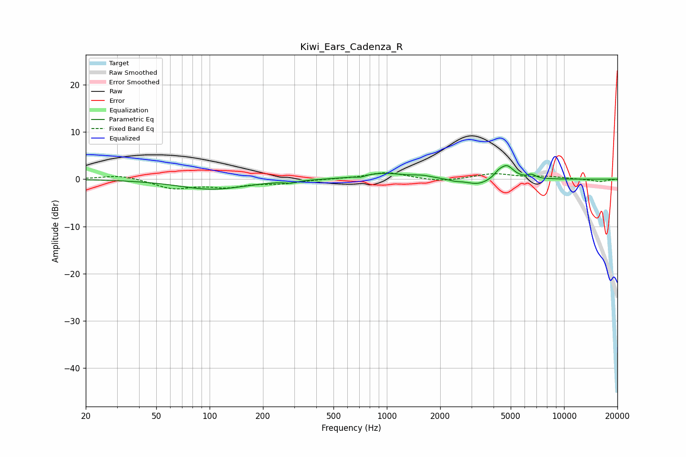

# Kiwi_Ears_Cadenza_R
See [usage instructions](https://github.com/jaakkopasanen/AutoEq#usage) for more options and info.

### Parametric EQs
Apply preamp of -3.0 dB when using parametric equalizer.

|   # | Type    |   Fc (Hz) |    Q |   Gain (dB) |
|-----|---------|-----------|------|-------------|
|   1 | Peaking |       104 | 0.75 |        -2.1 |
|   2 | Peaking |       286 | 4.19 |        -0.4 |
|   3 | Peaking |       708 | 5.59 |        -0.4 |
|   4 | Peaking |       940 | 1.16 |         1.3 |
|   5 | Peaking |      1586 | 2.66 |         0.5 |
|   6 | Peaking |      2414 | 4.38 |        -0.3 |
|   7 | Peaking |      3274 | 2.09 |        -1.3 |
|   8 | Peaking |      4262 | 5.93 |         0.8 |
|   9 | Peaking |      4751 | 3.52 |         2.9 |
|  10 | Peaking |      6560 | 6    |         0.8 |

### Fixed Band EQs
When using fixed band (also called graphic) equalizer, apply preamp of **-1.5 dB** (if available) and set gains manually with these parameters.

|   # | Type    |   Fc (Hz) |    Q |   Gain (dB) |
|-----|---------|-----------|------|-------------|
|   1 | Peaking |        31 | 1.41 |         0.9 |
|   2 | Peaking |        62 | 1.41 |        -1.9 |
|   3 | Peaking |       125 | 1.41 |        -1.4 |
|   4 | Peaking |       250 | 1.41 |        -0.8 |
|   5 | Peaking |       500 | 1.41 |         0   |
|   6 | Peaking |      1000 | 1.41 |         1.5 |
|   7 | Peaking |      2000 | 1.41 |        -0.6 |
|   8 | Peaking |      4000 | 1.41 |         1.2 |
|   9 | Peaking |      8000 | 1.41 |         0.5 |
|  10 | Peaking |     16000 | 1.41 |        -0.5 |

### Graphs

