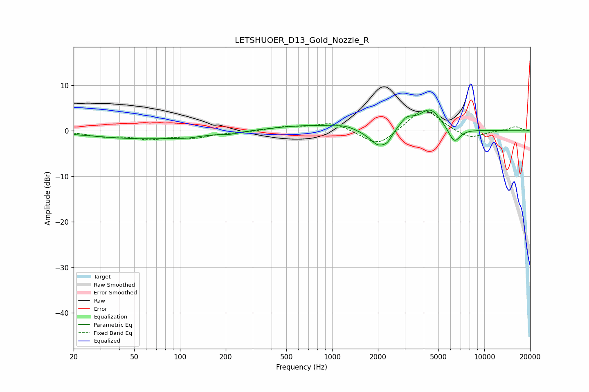

# LETSHUOER_D13_Gold_Nozzle_R
See [usage instructions](https://github.com/jaakkopasanen/AutoEq#usage) for more options and info.

### Parametric EQs
Apply preamp of -4.7 dB when using parametric equalizer.

|   # | Type    |   Fc (Hz) |    Q |   Gain (dB) |
|-----|---------|-----------|------|-------------|
|   1 | Peaking |        58 | 0.42 |        -1.7 |
|   2 | Peaking |       111 | 1.91 |        -0.4 |
|   3 | Peaking |       215 | 2.53 |        -0.4 |
|   4 | Peaking |       695 | 0.61 |         1.2 |
|   5 | Peaking |      1213 | 2.35 |         0.6 |
|   6 | Peaking |      2036 | 2.29 |        -3.9 |
|   7 | Peaking |      2317 | 5.76 |        -1   |
|   8 | Peaking |      3089 | 2.99 |         2.3 |
|   9 | Peaking |      4413 | 1.93 |         4.7 |
|  10 | Peaking |      6348 | 3.51 |        -3.4 |

### Fixed Band EQs
When using fixed band (also called graphic) equalizer, apply preamp of **-4.5 dB** (if available) and set gains manually with these parameters.

|   # | Type    |   Fc (Hz) |    Q |   Gain (dB) |
|-----|---------|-----------|------|-------------|
|   1 | Peaking |        31 | 1.41 |        -1   |
|   2 | Peaking |        62 | 1.41 |        -1.5 |
|   3 | Peaking |       125 | 1.41 |        -1.3 |
|   4 | Peaking |       250 | 1.41 |        -0.2 |
|   5 | Peaking |       500 | 1.41 |         0.8 |
|   6 | Peaking |      1000 | 1.41 |         1.9 |
|   7 | Peaking |      2000 | 1.41 |        -3.6 |
|   8 | Peaking |      4000 | 1.41 |         5.2 |
|   9 | Peaking |      8000 | 1.41 |        -1.9 |
|  10 | Peaking |     16000 | 1.41 |         0.9 |

### Graphs

