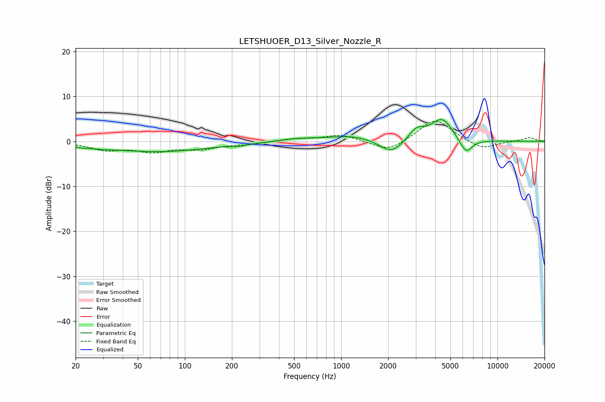

# LETSHUOER_D13_Silver_Nozzle_R
See [usage instructions](https://github.com/jaakkopasanen/AutoEq#usage) for more options and info.

### Parametric EQs
Apply preamp of -4.9 dB when using parametric equalizer.

|   # | Type    |   Fc (Hz) |    Q |   Gain (dB) |
|-----|---------|-----------|------|-------------|
|   1 | Peaking |        21 | 4.11 |        -0.4 |
|   2 | Peaking |        28 | 1.55 |        -0.5 |
|   3 | Peaking |        68 | 0.44 |        -2.2 |
|   4 | Peaking |       218 | 2.86 |        -0.4 |
|   5 | Peaking |       524 | 1.43 |         0.5 |
|   6 | Peaking |      1164 | 0.88 |         1.3 |
|   7 | Peaking |      2085 | 1.85 |        -3.2 |
|   8 | Peaking |      3034 | 2.99 |         2.4 |
|   9 | Peaking |      4413 | 1.95 |         5.1 |
|  10 | Peaking |      6273 | 3.24 |        -3.5 |

### Fixed Band EQs
When using fixed band (also called graphic) equalizer, apply preamp of **-4.6 dB** (if available) and set gains manually with these parameters.

|   # | Type    |   Fc (Hz) |    Q |   Gain (dB) |
|-----|---------|-----------|------|-------------|
|   1 | Peaking |        31 | 1.41 |        -1.7 |
|   2 | Peaking |        62 | 1.41 |        -2   |
|   3 | Peaking |       125 | 1.41 |        -1.5 |
|   4 | Peaking |       250 | 1.41 |        -0.5 |
|   5 | Peaking |       500 | 1.41 |         0.5 |
|   6 | Peaking |      1000 | 1.41 |         1.5 |
|   7 | Peaking |      2000 | 1.41 |        -2.4 |
|   8 | Peaking |      4000 | 1.41 |         5.1 |
|   9 | Peaking |      8000 | 1.41 |        -1.9 |
|  10 | Peaking |     16000 | 1.41 |         0.9 |

### Graphs

