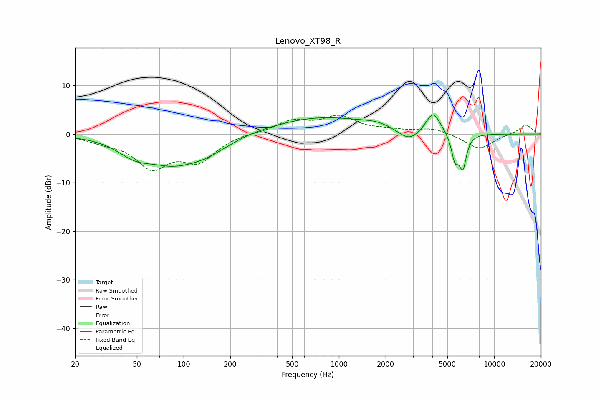

# Lenovo_XT98_R
See [usage instructions](https://github.com/jaakkopasanen/AutoEq#usage) for more options and info.

### Parametric EQs
Apply preamp of -4.0 dB when using parametric equalizer.

|   # | Type    |   Fc (Hz) |    Q |   Gain (dB) |
|-----|---------|-----------|------|-------------|
|   1 | Peaking |        48 | 1.28 |        -2.8 |
|   2 | Peaking |        85 | 0.83 |        -5.1 |
|   3 | Peaking |       137 | 1.2  |        -2.1 |
|   4 | Peaking |       192 | 1.61 |        -0.5 |
|   5 | Peaking |       772 | 0.45 |         3.4 |
|   6 | Peaking |      1770 | 1.42 |         0.9 |
|   7 | Peaking |      2830 | 2.04 |        -2.5 |
|   8 | Peaking |      4046 | 3.01 |         4.5 |
|   9 | Peaking |      5593 | 5.95 |        -5   |
|  10 | Peaking |      6284 | 5.94 |        -6.5 |

### Fixed Band EQs
When using fixed band (also called graphic) equalizer, apply preamp of **-4.0 dB** (if available) and set gains manually with these parameters.

|   # | Type    |   Fc (Hz) |    Q |   Gain (dB) |
|-----|---------|-----------|------|-------------|
|   1 | Peaking |        31 | 1.41 |        -1.2 |
|   2 | Peaking |        62 | 1.41 |        -6.4 |
|   3 | Peaking |       125 | 1.41 |        -5.1 |
|   4 | Peaking |       250 | 1.41 |         0.2 |
|   5 | Peaking |       500 | 1.41 |         2.5 |
|   6 | Peaking |      1000 | 1.41 |         3.3 |
|   7 | Peaking |      2000 | 1.41 |         0.6 |
|   8 | Peaking |      4000 | 1.41 |         1.2 |
|   9 | Peaking |      8000 | 1.41 |        -3.1 |
|  10 | Peaking |     16000 | 1.41 |         2   |

### Graphs

