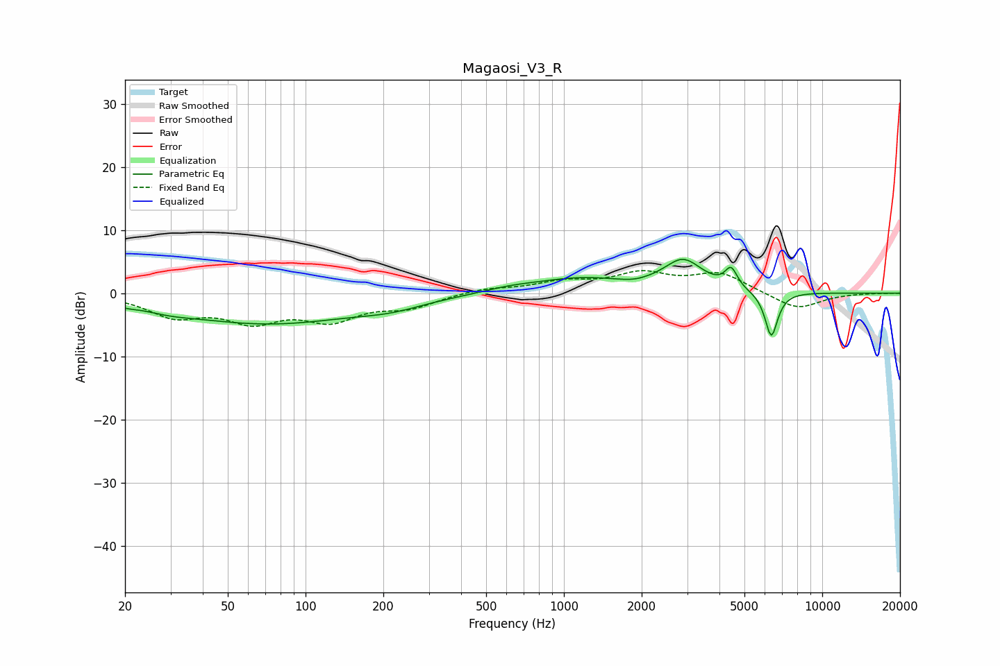

# Magaosi_V3_R
See [usage instructions](https://github.com/jaakkopasanen/AutoEq#usage) for more options and info.

### Parametric EQs
Apply preamp of -5.5 dB when using parametric equalizer.

|   # | Type    |   Fc (Hz) |    Q |   Gain (dB) |
|-----|---------|-----------|------|-------------|
|   1 | Peaking |        20 | 3.86 |        -0.3 |
|   2 | Peaking |        30 | 1.5  |        -0.6 |
|   3 | Peaking |        71 | 0.39 |        -4.7 |
|   4 | Peaking |       215 | 1.14 |        -1   |
|   5 | Peaking |       613 | 1.45 |         0.5 |
|   6 | Peaking |      1147 | 0.75 |         2.3 |
|   7 | Peaking |      1853 | 2.73 |        -0.4 |
|   8 | Peaking |      2897 | 1.87 |         4.8 |
|   9 | Peaking |      4440 | 6    |         3   |
|  10 | Peaking |      6352 | 5.49 |        -7.3 |

### Fixed Band EQs
When using fixed band (also called graphic) equalizer, apply preamp of **-3.7 dB** (if available) and set gains manually with these parameters.

|   # | Type    |   Fc (Hz) |    Q |   Gain (dB) |
|-----|---------|-----------|------|-------------|
|   1 | Peaking |        31 | 1.41 |        -3.3 |
|   2 | Peaking |        62 | 1.41 |        -3.9 |
|   3 | Peaking |       125 | 1.41 |        -3.8 |
|   4 | Peaking |       250 | 1.41 |        -2   |
|   5 | Peaking |       500 | 1.41 |         0.8 |
|   6 | Peaking |      1000 | 1.41 |         1.6 |
|   7 | Peaking |      2000 | 1.41 |         2.8 |
|   8 | Peaking |      4000 | 1.41 |         3   |
|   9 | Peaking |      8000 | 1.41 |        -2.6 |
|  10 | Peaking |     16000 | 1.41 |         0   |

### Graphs

