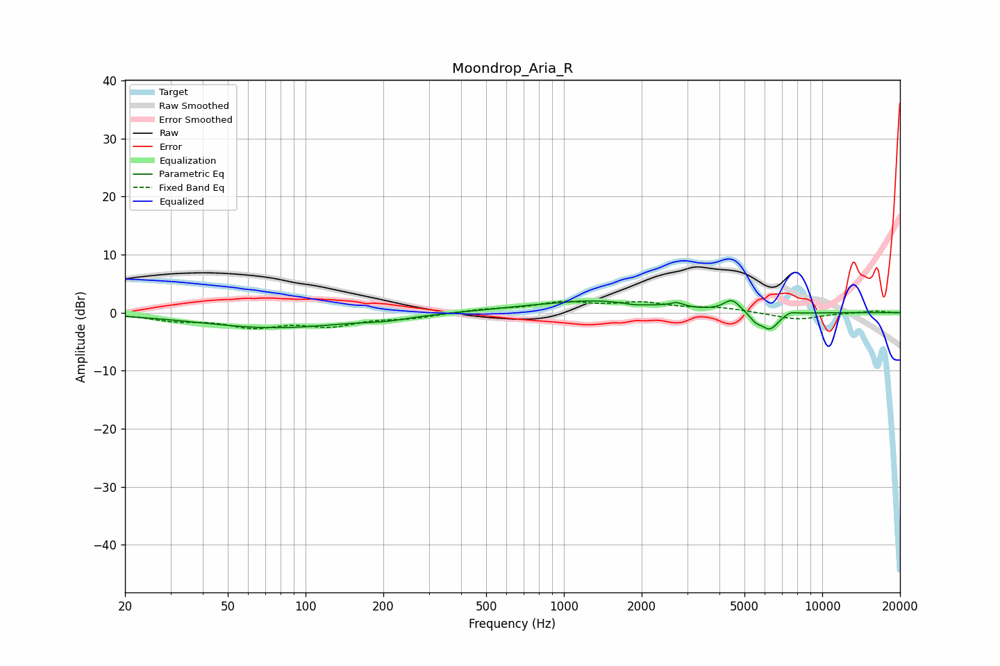

# Moondrop_Aria_R
See [usage instructions](https://github.com/jaakkopasanen/AutoEq#usage) for more options and info.

### Parametric EQs
Apply preamp of -2.2 dB when using parametric equalizer.

|   # | Type    |   Fc (Hz) |    Q |   Gain (dB) |
|-----|---------|-----------|------|-------------|
|   1 | Peaking |        76 | 0.49 |        -2.6 |
|   2 | Peaking |       207 | 1.61 |        -0.5 |
|   3 | Peaking |       934 | 1.89 |        -0.2 |
|   4 | Peaking |      1241 | 0.6  |         2.2 |
|   5 | Peaking |      1871 | 3.42 |        -0.3 |
|   6 | Peaking |      2735 | 5.36 |         0.7 |
|   7 | Peaking |      4473 | 4.45 |         2.1 |
|   8 | Peaking |      5520 | 6    |        -1.2 |
|   9 | Peaking |      6266 | 3.92 |        -2.9 |
|  10 | Peaking |      7513 | 5.84 |         0.5 |

### Fixed Band EQs
When using fixed band (also called graphic) equalizer, apply preamp of **-2.1 dB** (if available) and set gains manually with these parameters.

|   # | Type    |   Fc (Hz) |    Q |   Gain (dB) |
|-----|---------|-----------|------|-------------|
|   1 | Peaking |        31 | 1.41 |        -1.1 |
|   2 | Peaking |        62 | 1.41 |        -2.2 |
|   3 | Peaking |       125 | 1.41 |        -2   |
|   4 | Peaking |       250 | 1.41 |        -0.8 |
|   5 | Peaking |       500 | 1.41 |         0.5 |
|   6 | Peaking |      1000 | 1.41 |         1.6 |
|   7 | Peaking |      2000 | 1.41 |         1.5 |
|   8 | Peaking |      4000 | 1.41 |         0.7 |
|   9 | Peaking |      8000 | 1.41 |        -1.2 |
|  10 | Peaking |     16000 | 1.41 |         0.3 |

### Graphs

