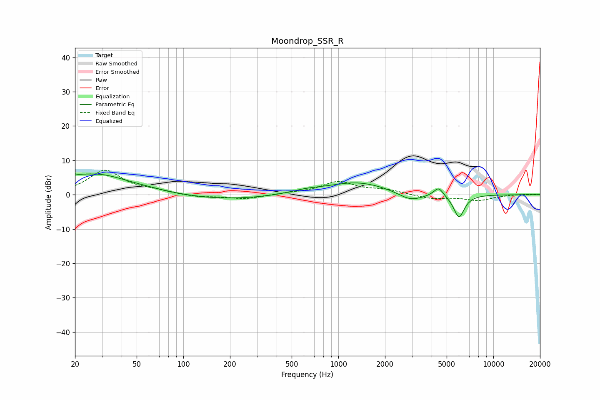

# Moondrop_SSR_R
See [usage instructions](https://github.com/jaakkopasanen/AutoEq#usage) for more options and info.

### Parametric EQs
Apply preamp of -6.2 dB when using parametric equalizer.

|   # | Type    |   Fc (Hz) |    Q |   Gain (dB) |
|-----|---------|-----------|------|-------------|
|   1 | Peaking |        20 | 5.91 |         3.1 |
|   2 | Peaking |        20 | 5.9  |        -2.9 |
|   3 | Peaking |        21 | 0.34 |         5.6 |
|   4 | Peaking |        30 | 1.26 |         1   |
|   5 | Peaking |       154 | 0.39 |        -1.8 |
|   6 | Peaking |       611 | 1.34 |         0.9 |
|   7 | Peaking |      1327 | 0.71 |         3.7 |
|   8 | Peaking |      2927 | 1.72 |        -2.5 |
|   9 | Peaking |      4434 | 4.5  |         2.7 |
|  10 | Peaking |      6004 | 3.9  |        -6.7 |

### Fixed Band EQs
When using fixed band (also called graphic) equalizer, apply preamp of **-7.2 dB** (if available) and set gains manually with these parameters.

|   # | Type    |   Fc (Hz) |    Q |   Gain (dB) |
|-----|---------|-----------|------|-------------|
|   1 | Peaking |        31 | 1.41 |         7   |
|   2 | Peaking |        62 | 1.41 |         0.9 |
|   3 | Peaking |       125 | 1.41 |        -0.7 |
|   4 | Peaking |       250 | 1.41 |        -1.3 |
|   5 | Peaking |       500 | 1.41 |         0.4 |
|   6 | Peaking |      1000 | 1.41 |         3.6 |
|   7 | Peaking |      2000 | 1.41 |         1.3 |
|   8 | Peaking |      4000 | 1.41 |        -1.2 |
|   9 | Peaking |      8000 | 1.41 |        -1.6 |
|  10 | Peaking |     16000 | 1.41 |         0.2 |

### Graphs

