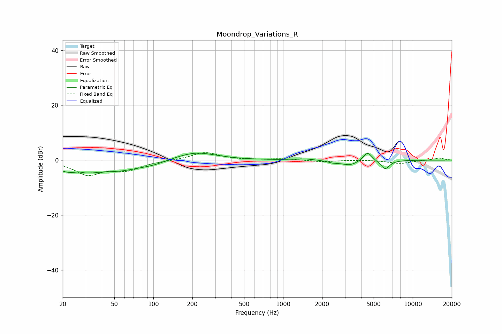

# Moondrop_Variations_R
See [usage instructions](https://github.com/jaakkopasanen/AutoEq#usage) for more options and info.

### Parametric EQs
Apply preamp of -2.6 dB when using parametric equalizer.

|   # | Type    |   Fc (Hz) |    Q |   Gain (dB) |
|-----|---------|-----------|------|-------------|
|   1 | Peaking |        25 | 0.95 |        -4.4 |
|   2 | Peaking |        26 | 3.81 |         1   |
|   3 | Peaking |        57 | 0.84 |        -2.9 |
|   4 | Peaking |       100 | 1.43 |        -1   |
|   5 | Peaking |       211 | 0.9  |         3   |
|   6 | Peaking |      1427 | 1.78 |         0.5 |
|   7 | Peaking |      2424 | 3.46 |        -0.7 |
|   8 | Peaking |      3284 | 2.16 |        -1.8 |
|   9 | Peaking |      4479 | 4.12 |         3.4 |
|  10 | Peaking |      6130 | 4.02 |        -3.3 |

### Fixed Band EQs
When using fixed band (also called graphic) equalizer, apply preamp of **-2.8 dB** (if available) and set gains manually with these parameters.

|   # | Type    |   Fc (Hz) |    Q |   Gain (dB) |
|-----|---------|-----------|------|-------------|
|   1 | Peaking |        31 | 1.41 |        -5.1 |
|   2 | Peaking |        62 | 1.41 |        -3.2 |
|   3 | Peaking |       125 | 1.41 |        -0.1 |
|   4 | Peaking |       250 | 1.41 |         2.9 |
|   5 | Peaking |       500 | 1.41 |         0   |
|   6 | Peaking |      1000 | 1.41 |         0.5 |
|   7 | Peaking |      2000 | 1.41 |        -0.6 |
|   8 | Peaking |      4000 | 1.41 |         0.1 |
|   9 | Peaking |      8000 | 1.41 |        -1.2 |
|  10 | Peaking |     16000 | 1.41 |         0.8 |

### Graphs

