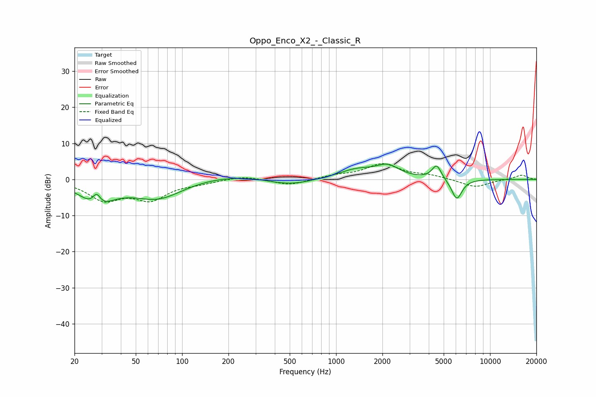

# Oppo_Enco_X2_-_Classic_R
See [usage instructions](https://github.com/jaakkopasanen/AutoEq#usage) for more options and info.

### Parametric EQs
Apply preamp of -4.3 dB when using parametric equalizer.

|   # | Type    |   Fc (Hz) |    Q |   Gain (dB) |
|-----|---------|-----------|------|-------------|
|   1 | Peaking |        28 | 5.56 |         3.5 |
|   2 | Peaking |        28 | 1.43 |        -6.4 |
|   3 | Peaking |        70 | 0.85 |        -5.5 |
|   4 | Peaking |       192 | 0.45 |         1.5 |
|   5 | Peaking |       418 | 1.26 |        -0.8 |
|   6 | Peaking |       546 | 1.11 |        -1.4 |
|   7 | Peaking |      1365 | 1.19 |         2.5 |
|   8 | Peaking |      2168 | 1.9  |         3.2 |
|   9 | Peaking |      4500 | 4.63 |         4   |
|  10 | Peaking |      6079 | 3.98 |        -5.7 |

### Fixed Band EQs
When using fixed band (also called graphic) equalizer, apply preamp of **-4.5 dB** (if available) and set gains manually with these parameters.

|   # | Type    |   Fc (Hz) |    Q |   Gain (dB) |
|-----|---------|-----------|------|-------------|
|   1 | Peaking |        31 | 1.41 |        -5.3 |
|   2 | Peaking |        62 | 1.41 |        -5.1 |
|   3 | Peaking |       125 | 1.41 |        -0.8 |
|   4 | Peaking |       250 | 1.41 |         1   |
|   5 | Peaking |       500 | 1.41 |        -1.7 |
|   6 | Peaking |      1000 | 1.41 |         0.9 |
|   7 | Peaking |      2000 | 1.41 |         4.1 |
|   8 | Peaking |      4000 | 1.41 |         1   |
|   9 | Peaking |      8000 | 1.41 |        -2.2 |
|  10 | Peaking |     16000 | 1.41 |         1.2 |

### Graphs

