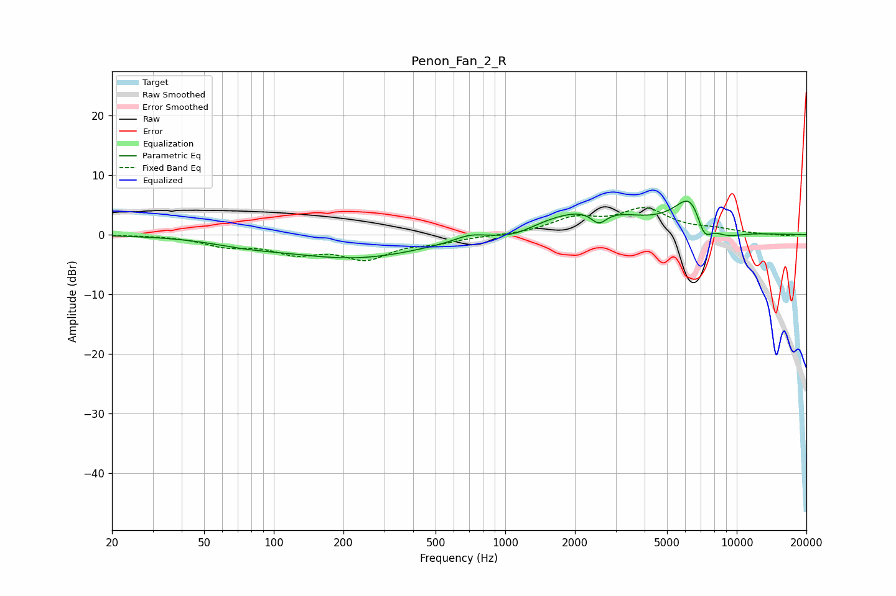

# Penon_Fan_2_R
See [usage instructions](https://github.com/jaakkopasanen/AutoEq#usage) for more options and info.

### Parametric EQs
Apply preamp of -5.7 dB when using parametric equalizer.

|   # | Type    |   Fc (Hz) |    Q |   Gain (dB) |
|-----|---------|-----------|------|-------------|
|   1 | Peaking |        76 | 0.92 |        -0.9 |
|   2 | Peaking |       226 | 0.46 |        -3.8 |
|   3 | Peaking |       700 | 2.38 |         0.8 |
|   4 | Peaking |      1095 | 1.62 |        -1.2 |
|   5 | Peaking |      2226 | 0.67 |         4.2 |
|   6 | Peaking |      2536 | 4.22 |        -2.2 |
|   7 | Peaking |      3314 | 5.04 |         0.1 |
|   8 | Peaking |      6396 | 1.97 |         6.7 |
|   9 | Peaking |      7208 | 3.8  |        -4.6 |
|  10 | Peaking |      8963 | 1.8  |        -1.5 |

### Fixed Band EQs
When using fixed band (also called graphic) equalizer, apply preamp of **-4.6 dB** (if available) and set gains manually with these parameters.

|   # | Type    |   Fc (Hz) |    Q |   Gain (dB) |
|-----|---------|-----------|------|-------------|
|   1 | Peaking |        31 | 1.41 |        -0   |
|   2 | Peaking |        62 | 1.41 |        -1.7 |
|   3 | Peaking |       125 | 1.41 |        -2.6 |
|   4 | Peaking |       250 | 1.41 |        -3.6 |
|   5 | Peaking |       500 | 1.41 |        -1.1 |
|   6 | Peaking |      1000 | 1.41 |        -0.1 |
|   7 | Peaking |      2000 | 1.41 |         2.5 |
|   8 | Peaking |      4000 | 1.41 |         4   |
|   9 | Peaking |      8000 | 1.41 |         0.7 |
|  10 | Peaking |     16000 | 1.41 |        -0.2 |

### Graphs

