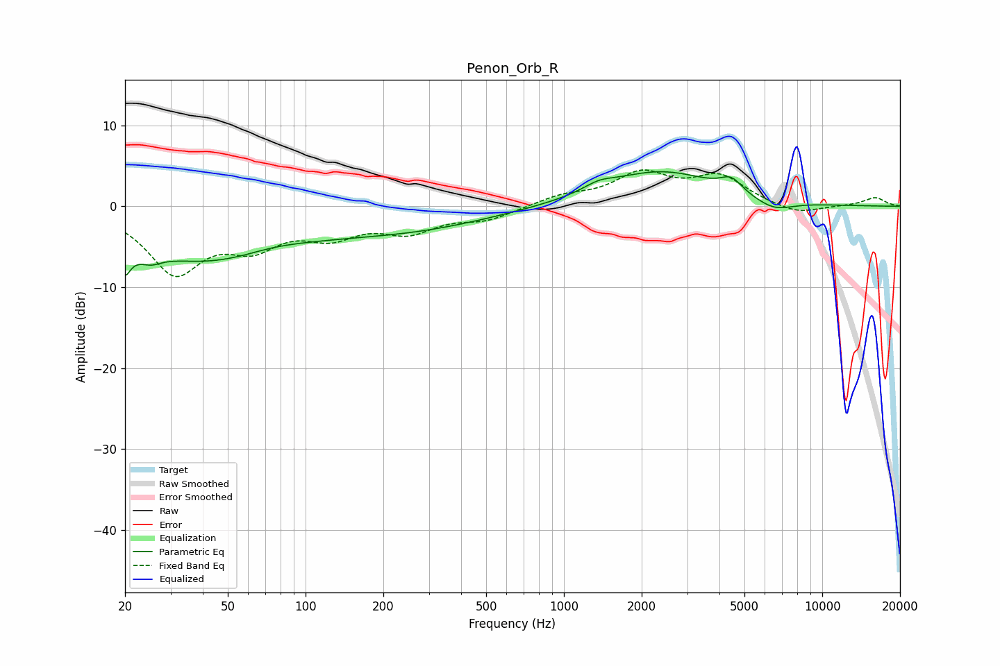

# Penon_Orb_R
See [usage instructions](https://github.com/jaakkopasanen/AutoEq#usage) for more options and info.

### Parametric EQs
Apply preamp of -4.4 dB when using parametric equalizer.

|   # | Type    |   Fc (Hz) |    Q |   Gain (dB) |
|-----|---------|-----------|------|-------------|
|   1 | Peaking |        20 | 5.48 |        -7   |
|   2 | Peaking |        20 | 5.73 |         3.3 |
|   3 | Peaking |        25 | 3.31 |        -1.2 |
|   4 | Peaking |        41 | 0.43 |        -6.5 |
|   5 | Peaking |        75 | 1.09 |         0.7 |
|   6 | Peaking |       250 | 0.44 |        -2.5 |
|   7 | Peaking |      1364 | 2.4  |         0.9 |
|   8 | Peaking |      2360 | 0.64 |         4.3 |
|   9 | Peaking |      4443 | 3.37 |         1.6 |
|  10 | Peaking |      6491 | 1.8  |        -1.4 |

### Fixed Band EQs
When using fixed band (also called graphic) equalizer, apply preamp of **-4.6 dB** (if available) and set gains manually with these parameters.

|   # | Type    |   Fc (Hz) |    Q |   Gain (dB) |
|-----|---------|-----------|------|-------------|
|   1 | Peaking |        31 | 1.41 |        -7.8 |
|   2 | Peaking |        62 | 1.41 |        -4   |
|   3 | Peaking |       125 | 1.41 |        -3   |
|   4 | Peaking |       250 | 1.41 |        -2.7 |
|   5 | Peaking |       500 | 1.41 |        -1.5 |
|   6 | Peaking |      1000 | 1.41 |         1.2 |
|   7 | Peaking |      2000 | 1.41 |         3.8 |
|   8 | Peaking |      4000 | 1.41 |         3.5 |
|   9 | Peaking |      8000 | 1.41 |        -1.1 |
|  10 | Peaking |     16000 | 1.41 |         1.1 |

### Graphs

