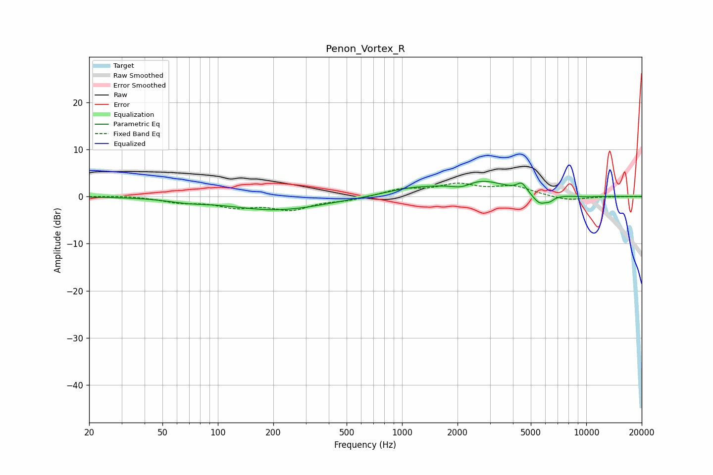

# Penon_Vortex_R
See [usage instructions](https://github.com/jaakkopasanen/AutoEq#usage) for more options and info.

### Parametric EQs
Apply preamp of -3.3 dB when using parametric equalizer.

|   # | Type    |   Fc (Hz) |    Q |   Gain (dB) |
|-----|---------|-----------|------|-------------|
|   1 | Peaking |        68 | 1.33 |        -0.6 |
|   2 | Peaking |       209 | 0.55 |        -2.8 |
|   3 | Peaking |      1045 | 0.99 |         1.1 |
|   4 | Peaking |      1325 | 1.22 |         0.3 |
|   5 | Peaking |      2119 | 2.34 |        -1.5 |
|   6 | Peaking |      2548 | 0.92 |         3.7 |
|   7 | Peaking |      4469 | 5.37 |         1.9 |
|   8 | Peaking |      5595 | 3.49 |        -2.3 |
|   9 | Peaking |      6353 | 6    |        -0.8 |
|  10 | Peaking |      9817 | 1.91 |        -0.2 |

### Fixed Band EQs
When using fixed band (also called graphic) equalizer, apply preamp of **-2.9 dB** (if available) and set gains manually with these parameters.

|   # | Type    |   Fc (Hz) |    Q |   Gain (dB) |
|-----|---------|-----------|------|-------------|
|   1 | Peaking |        31 | 1.41 |         0.2 |
|   2 | Peaking |        62 | 1.41 |        -1.1 |
|   3 | Peaking |       125 | 1.41 |        -1.9 |
|   4 | Peaking |       250 | 1.41 |        -2.5 |
|   5 | Peaking |       500 | 1.41 |        -0.7 |
|   6 | Peaking |      1000 | 1.41 |         1.5 |
|   7 | Peaking |      2000 | 1.41 |         2.3 |
|   8 | Peaking |      4000 | 1.41 |         2   |
|   9 | Peaking |      8000 | 1.41 |        -0.9 |
|  10 | Peaking |     16000 | 1.41 |         0   |

### Graphs

