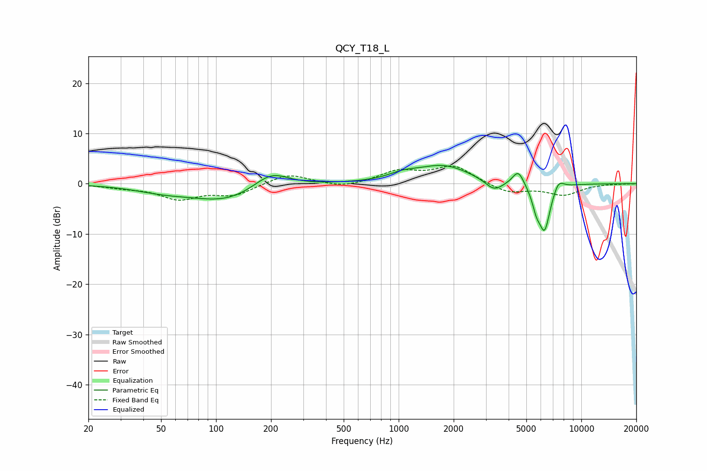

# QCY_T18_L
See [usage instructions](https://github.com/jaakkopasanen/AutoEq#usage) for more options and info.

### Parametric EQs
Apply preamp of -3.7 dB when using parametric equalizer.

|   # | Type    |   Fc (Hz) |    Q |   Gain (dB) |
|-----|---------|-----------|------|-------------|
|   1 | Peaking |        51 | 0.92 |        -1.1 |
|   2 | Peaking |       114 | 0.73 |        -3.4 |
|   3 | Peaking |       200 | 1.44 |         3.5 |
|   4 | Peaking |      1052 | 1.81 |         1.1 |
|   5 | Peaking |      1753 | 0.95 |         3.5 |
|   6 | Peaking |      3329 | 2.85 |        -2.2 |
|   7 | Peaking |      4514 | 4.49 |         3   |
|   8 | Peaking |      5674 | 6    |        -3   |
|   9 | Peaking |      6294 | 4.22 |        -9.1 |
|  10 | Peaking |      7495 | 4.59 |         2.1 |

### Fixed Band EQs
When using fixed band (also called graphic) equalizer, apply preamp of **-3.6 dB** (if available) and set gains manually with these parameters.

|   # | Type    |   Fc (Hz) |    Q |   Gain (dB) |
|-----|---------|-----------|------|-------------|
|   1 | Peaking |        31 | 1.41 |        -0.6 |
|   2 | Peaking |        62 | 1.41 |        -2.8 |
|   3 | Peaking |       125 | 1.41 |        -2.2 |
|   4 | Peaking |       250 | 1.41 |         2.1 |
|   5 | Peaking |       500 | 1.41 |        -0.9 |
|   6 | Peaking |      1000 | 1.41 |         2.4 |
|   7 | Peaking |      2000 | 1.41 |         3.5 |
|   8 | Peaking |      4000 | 1.41 |        -1.9 |
|   9 | Peaking |      8000 | 1.41 |        -2.1 |
|  10 | Peaking |     16000 | 1.41 |        -0   |

### Graphs

