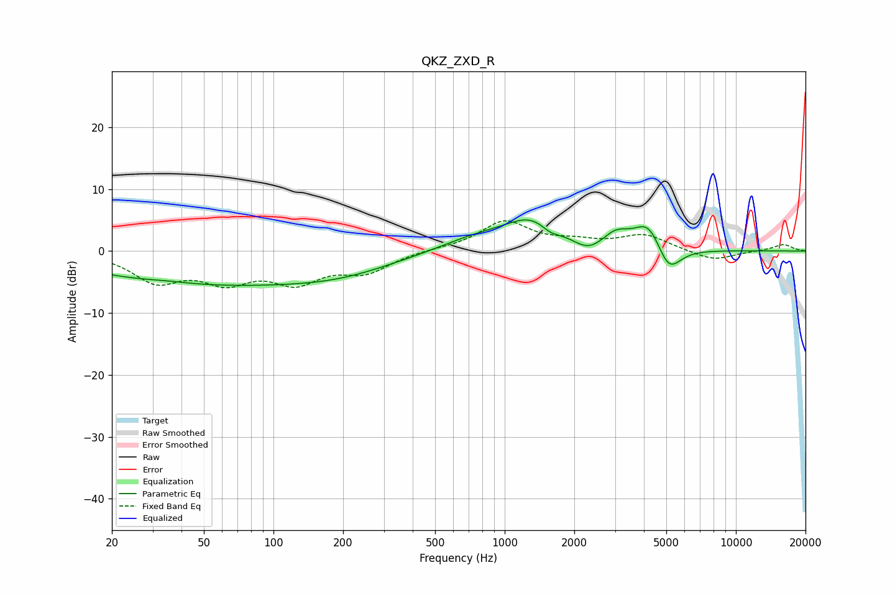

# QKZ_ZXD_R
See [usage instructions](https://github.com/jaakkopasanen/AutoEq#usage) for more options and info.

### Parametric EQs
Apply preamp of -5.1 dB when using parametric equalizer.

|   # | Type    |   Fc (Hz) |    Q |   Gain (dB) |
|-----|---------|-----------|------|-------------|
|   1 | Peaking |        35 | 1.56 |         0.3 |
|   2 | Peaking |        54 | 0.25 |        -5.2 |
|   3 | Peaking |       202 | 0.62 |        -1.6 |
|   4 | Peaking |       744 | 0.87 |         1.9 |
|   5 | Peaking |      1331 | 1.16 |         4.9 |
|   6 | Peaking |      1574 | 3.16 |        -1.4 |
|   7 | Peaking |      2296 | 2.2  |        -2   |
|   8 | Peaking |      3035 | 2.4  |         2.3 |
|   9 | Peaking |      4193 | 2.31 |         4.7 |
|  10 | Peaking |      5108 | 2.65 |        -4.7 |

### Fixed Band EQs
When using fixed band (also called graphic) equalizer, apply preamp of **-5.0 dB** (if available) and set gains manually with these parameters.

|   # | Type    |   Fc (Hz) |    Q |   Gain (dB) |
|-----|---------|-----------|------|-------------|
|   1 | Peaking |        31 | 1.41 |        -4.5 |
|   2 | Peaking |        62 | 1.41 |        -4.2 |
|   3 | Peaking |       125 | 1.41 |        -4.4 |
|   4 | Peaking |       250 | 1.41 |        -3.1 |
|   5 | Peaking |       500 | 1.41 |         0.2 |
|   6 | Peaking |      1000 | 1.41 |         4.7 |
|   7 | Peaking |      2000 | 1.41 |         1.1 |
|   8 | Peaking |      4000 | 1.41 |         2.5 |
|   9 | Peaking |      8000 | 1.41 |        -1.6 |
|  10 | Peaking |     16000 | 1.41 |         1.1 |

### Graphs

