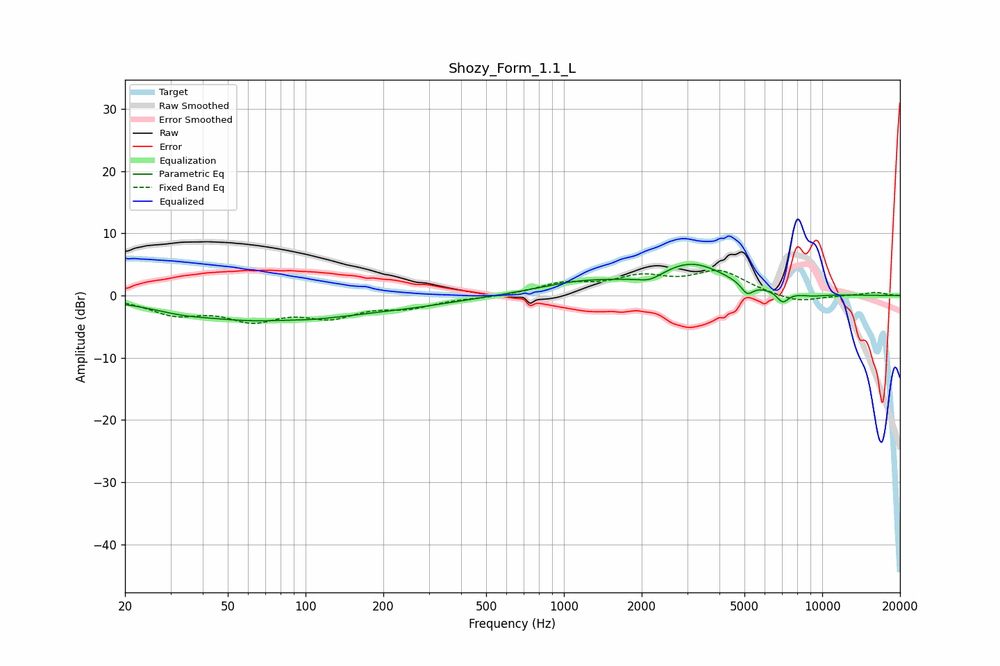

# Shozy_Form_1.1_L
See [usage instructions](https://github.com/jaakkopasanen/AutoEq#usage) for more options and info.

### Parametric EQs
Apply preamp of -5.1 dB when using parametric equalizer.

|   # | Type    |   Fc (Hz) |    Q |   Gain (dB) |
|-----|---------|-----------|------|-------------|
|   1 | Peaking |        33 | 1.41 |        -0.7 |
|   2 | Peaking |        75 | 0.44 |        -4.1 |
|   3 | Peaking |        81 | 1.71 |         0.3 |
|   4 | Peaking |       270 | 0.7  |        -0.8 |
|   5 | Peaking |      1171 | 0.82 |         1.9 |
|   6 | Peaking |      2154 | 2.9  |        -1.1 |
|   7 | Peaking |      3123 | 1.01 |         4.9 |
|   8 | Peaking |      5123 | 6    |        -1.8 |
|   9 | Peaking |      7029 | 5.84 |        -1.8 |
|  10 | Peaking |      9077 | 2.11 |        -0.4 |

### Fixed Band EQs
When using fixed band (also called graphic) equalizer, apply preamp of **-4.2 dB** (if available) and set gains manually with these parameters.

|   # | Type    |   Fc (Hz) |    Q |   Gain (dB) |
|-----|---------|-----------|------|-------------|
|   1 | Peaking |        31 | 1.41 |        -2.6 |
|   2 | Peaking |        62 | 1.41 |        -3.4 |
|   3 | Peaking |       125 | 1.41 |        -2.9 |
|   4 | Peaking |       250 | 1.41 |        -1.6 |
|   5 | Peaking |       500 | 1.41 |        -0.3 |
|   6 | Peaking |      1000 | 1.41 |         1.8 |
|   7 | Peaking |      2000 | 1.41 |         2.6 |
|   8 | Peaking |      4000 | 1.41 |         3.7 |
|   9 | Peaking |      8000 | 1.41 |        -1.3 |
|  10 | Peaking |     16000 | 1.41 |         0.5 |

### Graphs

