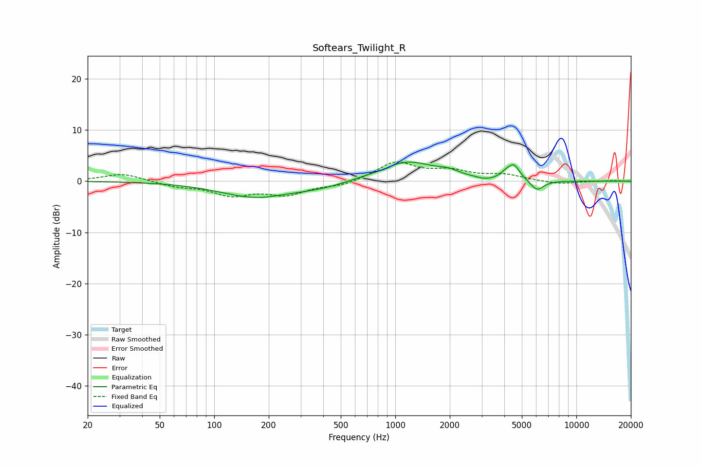

# Softears_Twilight_R
See [usage instructions](https://github.com/jaakkopasanen/AutoEq#usage) for more options and info.

### Parametric EQs
Apply preamp of -3.8 dB when using parametric equalizer.

|   # | Type    |   Fc (Hz) |    Q |   Gain (dB) |
|-----|---------|-----------|------|-------------|
|   1 | Peaking |       172 | 0.7  |        -3.1 |
|   2 | Peaking |       225 | 1.88 |         0.1 |
|   3 | Peaking |       398 | 0.94 |        -0.9 |
|   4 | Peaking |       853 | 3.11 |        -0.3 |
|   5 | Peaking |      1147 | 0.91 |         3.9 |
|   6 | Peaking |      1969 | 2.48 |         0.8 |
|   7 | Peaking |      3145 | 3.19 |        -0.5 |
|   8 | Peaking |      4061 | 5.64 |         0.7 |
|   9 | Peaking |      4509 | 4.09 |         3   |
|  10 | Peaking |      6065 | 3.65 |        -2.1 |

### Fixed Band EQs
When using fixed band (also called graphic) equalizer, apply preamp of **-3.9 dB** (if available) and set gains manually with these parameters.

|   # | Type    |   Fc (Hz) |    Q |   Gain (dB) |
|-----|---------|-----------|------|-------------|
|   1 | Peaking |        31 | 1.41 |         1.5 |
|   2 | Peaking |        62 | 1.41 |        -0.9 |
|   3 | Peaking |       125 | 1.41 |        -2.5 |
|   4 | Peaking |       250 | 1.41 |        -2.4 |
|   5 | Peaking |       500 | 1.41 |        -0.9 |
|   6 | Peaking |      1000 | 1.41 |         3.7 |
|   7 | Peaking |      2000 | 1.41 |         1.8 |
|   8 | Peaking |      4000 | 1.41 |         1.1 |
|   9 | Peaking |      8000 | 1.41 |        -0.6 |
|  10 | Peaking |     16000 | 1.41 |         0.1 |

### Graphs

