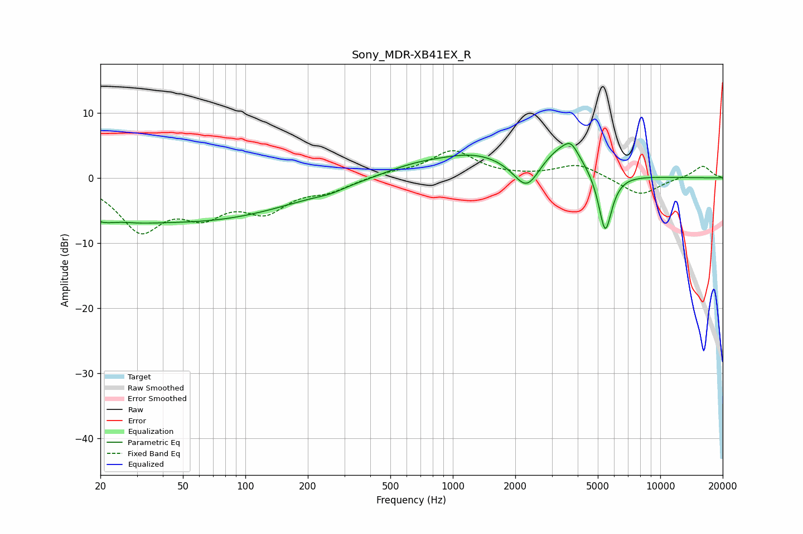

# Sony_MDR-XB41EX_R
See [usage instructions](https://github.com/jaakkopasanen/AutoEq#usage) for more options and info.

### Parametric EQs
Apply preamp of -5.4 dB when using parametric equalizer.

|   # | Type    |   Fc (Hz) |    Q |   Gain (dB) |
|-----|---------|-----------|------|-------------|
|   1 | Peaking |        22 | 1.07 |        -5.3 |
|   2 | Peaking |        24 | 1.66 |         2.3 |
|   3 | Peaking |        64 | 0.31 |        -6.1 |
|   4 | Peaking |       256 | 2.38 |        -0.4 |
|   5 | Peaking |       655 | 0.82 |         1.6 |
|   6 | Peaking |      1297 | 0.81 |         3   |
|   7 | Peaking |      2275 | 2.25 |        -4.7 |
|   8 | Peaking |      3366 | 1.25 |         4.7 |
|   9 | Peaking |      3705 | 4.1  |         1.8 |
|  10 | Peaking |      5427 | 4.15 |        -9.7 |

### Fixed Band EQs
When using fixed band (also called graphic) equalizer, apply preamp of **-4.3 dB** (if available) and set gains manually with these parameters.

|   # | Type    |   Fc (Hz) |    Q |   Gain (dB) |
|-----|---------|-----------|------|-------------|
|   1 | Peaking |        31 | 1.41 |        -7.6 |
|   2 | Peaking |        62 | 1.41 |        -4.6 |
|   3 | Peaking |       125 | 1.41 |        -4.4 |
|   4 | Peaking |       250 | 1.41 |        -1.7 |
|   5 | Peaking |       500 | 1.41 |         0.7 |
|   6 | Peaking |      1000 | 1.41 |         4.1 |
|   7 | Peaking |      2000 | 1.41 |         0.1 |
|   8 | Peaking |      4000 | 1.41 |         2.1 |
|   9 | Peaking |      8000 | 1.41 |        -2.8 |
|  10 | Peaking |     16000 | 1.41 |         1.9 |

### Graphs

