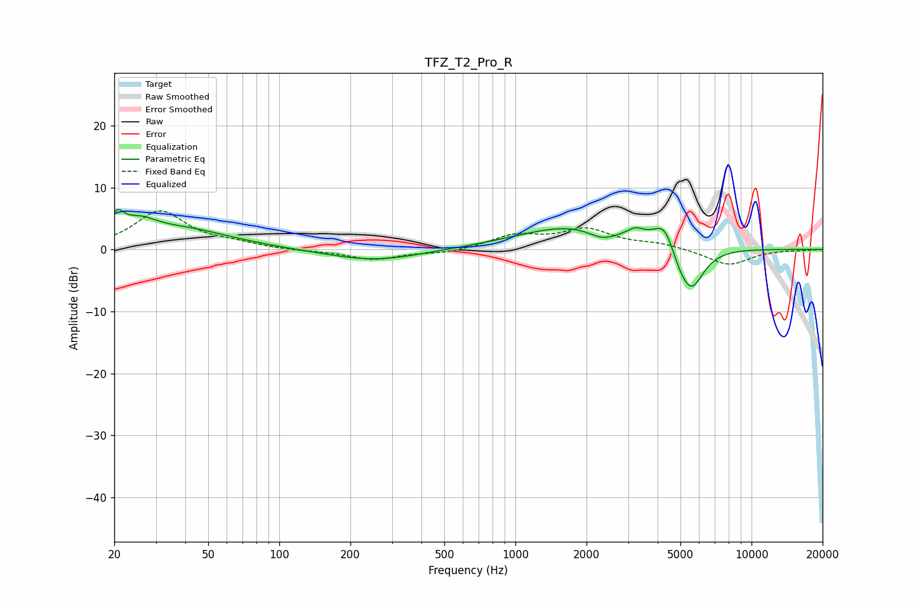

# TFZ_T2_Pro_R
See [usage instructions](https://github.com/jaakkopasanen/AutoEq#usage) for more options and info.

### Parametric EQs
Apply preamp of -6.5 dB when using parametric equalizer.

|   # | Type    |   Fc (Hz) |    Q |   Gain (dB) |
|-----|---------|-----------|------|-------------|
|   1 | Peaking |        21 | 4.99 |         3.2 |
|   2 | Peaking |        25 | 1.93 |         2.7 |
|   3 | Peaking |        39 | 0.68 |         3.1 |
|   4 | Peaking |       253 | 0.72 |        -1.9 |
|   5 | Peaking |      1825 | 0.59 |         4   |
|   6 | Peaking |      2333 | 2.22 |        -1.7 |
|   7 | Peaking |      3231 | 3.89 |         1.3 |
|   8 | Peaking |      4304 | 2.9  |         4.6 |
|   9 | Peaking |      4919 | 3.15 |        -2.2 |
|  10 | Peaking |      5563 | 2.53 |        -6.9 |

### Fixed Band EQs
When using fixed band (also called graphic) equalizer, apply preamp of **-6.3 dB** (if available) and set gains manually with these parameters.

|   # | Type    |   Fc (Hz) |    Q |   Gain (dB) |
|-----|---------|-----------|------|-------------|
|   1 | Peaking |        31 | 1.41 |         6.1 |
|   2 | Peaking |        62 | 1.41 |         0.8 |
|   3 | Peaking |       125 | 1.41 |        -0.2 |
|   4 | Peaking |       250 | 1.41 |        -1.6 |
|   5 | Peaking |       500 | 1.41 |        -0.6 |
|   6 | Peaking |      1000 | 1.41 |         2.1 |
|   7 | Peaking |      2000 | 1.41 |         3   |
|   8 | Peaking |      4000 | 1.41 |         0.8 |
|   9 | Peaking |      8000 | 1.41 |        -2.6 |
|  10 | Peaking |     16000 | 1.41 |        -0.1 |

### Graphs

