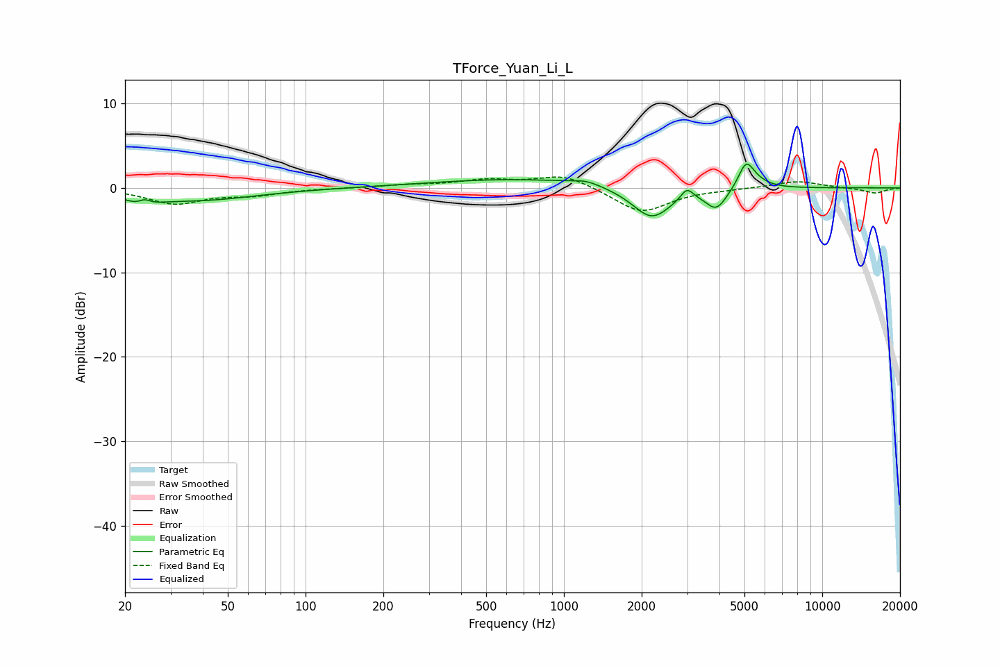

# TForce_Yuan_Li_L
See [usage instructions](https://github.com/jaakkopasanen/AutoEq#usage) for more options and info.

### Parametric EQs
Apply preamp of -2.9 dB when using parametric equalizer.

|   # | Type    |   Fc (Hz) |    Q |   Gain (dB) |
|-----|---------|-----------|------|-------------|
|   1 | Peaking |        23 | 2.89 |        -1.3 |
|   2 | Peaking |        24 | 5.41 |         1   |
|   3 | Peaking |        37 | 0.6  |        -1.5 |
|   4 | Peaking |       684 | 0.41 |         1.1 |
|   5 | Peaking |      1218 | 2.72 |         0.5 |
|   6 | Peaking |      2186 | 1.86 |        -3.8 |
|   7 | Peaking |      2994 | 6    |         1.3 |
|   8 | Peaking |      3893 | 3.38 |        -2.4 |
|   9 | Peaking |      5072 | 4.72 |         2.9 |
|  10 | Peaking |      5544 | 2.78 |         0.6 |

### Fixed Band EQs
When using fixed band (also called graphic) equalizer, apply preamp of **-1.4 dB** (if available) and set gains manually with these parameters.

|   # | Type    |   Fc (Hz) |    Q |   Gain (dB) |
|-----|---------|-----------|------|-------------|
|   1 | Peaking |        31 | 1.41 |        -1.8 |
|   2 | Peaking |        62 | 1.41 |        -0.7 |
|   3 | Peaking |       125 | 1.41 |        -0   |
|   4 | Peaking |       250 | 1.41 |         0.3 |
|   5 | Peaking |       500 | 1.41 |         0.8 |
|   6 | Peaking |      1000 | 1.41 |         1.6 |
|   7 | Peaking |      2000 | 1.41 |        -3   |
|   8 | Peaking |      4000 | 1.41 |        -0.1 |
|   9 | Peaking |      8000 | 1.41 |         0.8 |
|  10 | Peaking |     16000 | 1.41 |        -0.6 |

### Graphs

