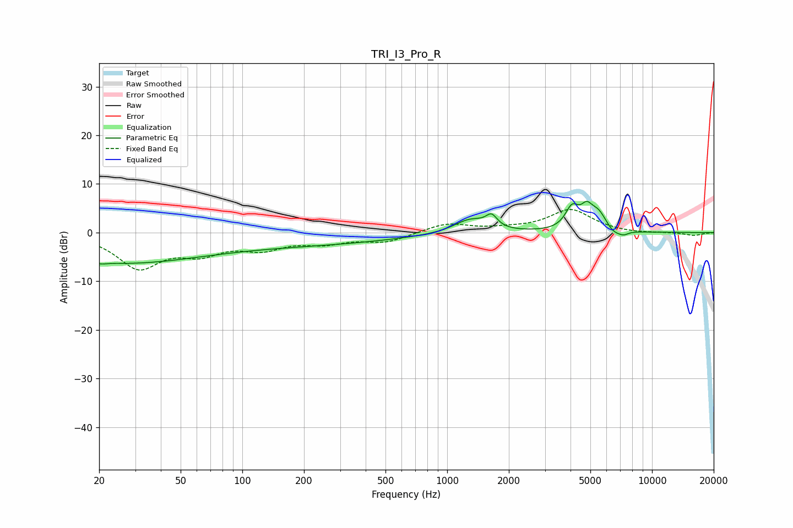

# TRI_I3_Pro_R
See [usage instructions](https://github.com/jaakkopasanen/AutoEq#usage) for more options and info.

### Parametric EQs
Apply preamp of -6.5 dB when using parametric equalizer.

|   # | Type    |   Fc (Hz) |    Q |   Gain (dB) |
|-----|---------|-----------|------|-------------|
|   1 | Peaking |        20 | 5.35 |        -0.4 |
|   2 | Peaking |        21 | 0.36 |        -4.6 |
|   3 | Peaking |       106 | 0.18 |        -2.7 |
|   4 | Peaking |      1296 | 1.75 |         2.9 |
|   5 | Peaking |      1648 | 5.19 |         2.4 |
|   6 | Peaking |      4071 | 4.25 |         4.4 |
|   7 | Peaking |      4796 | 4.93 |         3.3 |
|   8 | Peaking |      5483 | 3.15 |         3.8 |
|   9 | Peaking |      6477 | 3.34 |        -1.5 |
|  10 | Peaking |      7264 | 5.81 |        -0.7 |

### Fixed Band EQs
When using fixed band (also called graphic) equalizer, apply preamp of **-4.8 dB** (if available) and set gains manually with these parameters.

|   # | Type    |   Fc (Hz) |    Q |   Gain (dB) |
|-----|---------|-----------|------|-------------|
|   1 | Peaking |        31 | 1.41 |        -6.9 |
|   2 | Peaking |        62 | 1.41 |        -3.5 |
|   3 | Peaking |       125 | 1.41 |        -2.8 |
|   4 | Peaking |       250 | 1.41 |        -1.8 |
|   5 | Peaking |       500 | 1.41 |        -1.8 |
|   6 | Peaking |      1000 | 1.41 |         1.9 |
|   7 | Peaking |      2000 | 1.41 |         0.5 |
|   8 | Peaking |      4000 | 1.41 |         4.7 |
|   9 | Peaking |      8000 | 1.41 |        -0.2 |
|  10 | Peaking |     16000 | 1.41 |        -0.6 |

### Graphs

