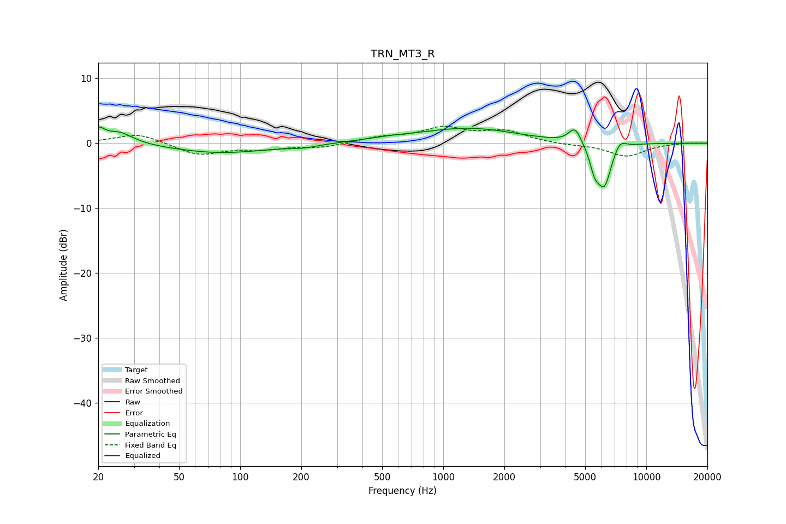

# TRN_MT3_R
See [usage instructions](https://github.com/jaakkopasanen/AutoEq#usage) for more options and info.

### Parametric EQs
Apply preamp of -2.6 dB when using parametric equalizer.

|   # | Type    |   Fc (Hz) |    Q |   Gain (dB) |
|-----|---------|-----------|------|-------------|
|   1 | Peaking |        20 | 4.69 |         1.8 |
|   2 | Peaking |        25 | 2.05 |         1.8 |
|   3 | Peaking |        80 | 0.6  |        -1.5 |
|   4 | Peaking |       205 | 2.1  |        -0.4 |
|   5 | Peaking |       540 | 1.09 |         0.4 |
|   6 | Peaking |      1336 | 0.6  |         2.3 |
|   7 | Peaking |      4457 | 4.45 |         2.5 |
|   8 | Peaking |      5566 | 5.96 |        -2.8 |
|   9 | Peaking |      6211 | 3.74 |        -6.6 |
|  10 | Peaking |      7395 | 4.39 |         1.6 |

### Fixed Band EQs
When using fixed band (also called graphic) equalizer, apply preamp of **-2.7 dB** (if available) and set gains manually with these parameters.

|   # | Type    |   Fc (Hz) |    Q |   Gain (dB) |
|-----|---------|-----------|------|-------------|
|   1 | Peaking |        31 | 1.41 |         1.5 |
|   2 | Peaking |        62 | 1.41 |        -1.8 |
|   3 | Peaking |       125 | 1.41 |        -0.8 |
|   4 | Peaking |       250 | 1.41 |        -0.6 |
|   5 | Peaking |       500 | 1.41 |         0.8 |
|   6 | Peaking |      1000 | 1.41 |         2.2 |
|   7 | Peaking |      2000 | 1.41 |         1.7 |
|   8 | Peaking |      4000 | 1.41 |        -0.2 |
|   9 | Peaking |      8000 | 1.41 |        -2   |
|  10 | Peaking |     16000 | 1.41 |         0.1 |

### Graphs

