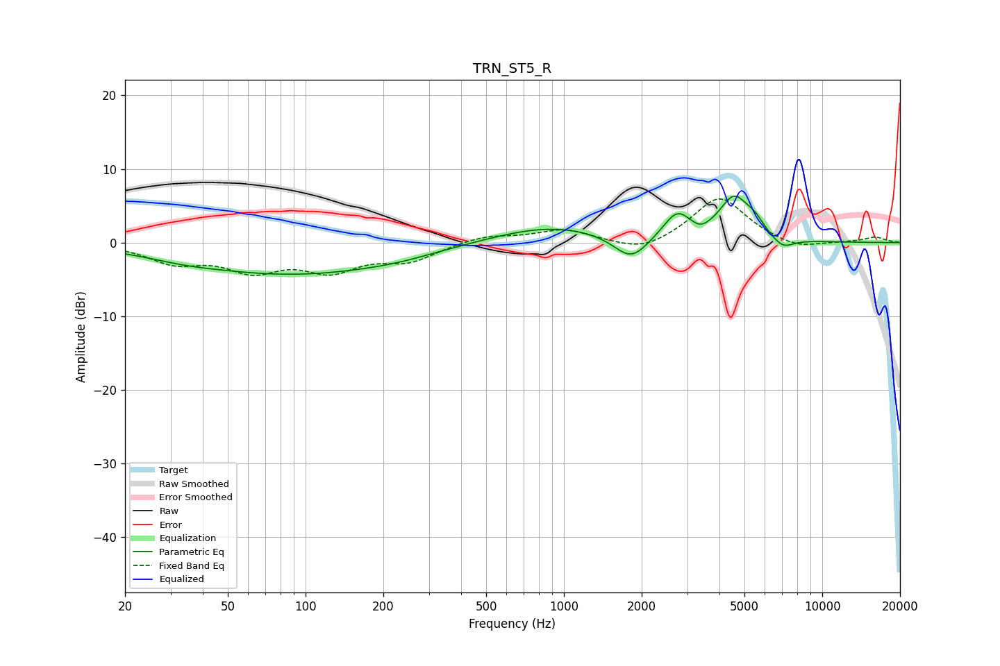

# TRN_ST5_R
See [usage instructions](https://github.com/jaakkopasanen/AutoEq#usage) for more options and info.

### Parametric EQs
Apply preamp of -6.4 dB when using parametric equalizer.

|   # | Type    |   Fc (Hz) |    Q |   Gain (dB) |
|-----|---------|-----------|------|-------------|
|   1 | Peaking |        33 | 1.06 |        -0.5 |
|   2 | Peaking |        89 | 0.35 |        -4.2 |
|   3 | Peaking |       226 | 0.98 |        -0.4 |
|   4 | Peaking |       889 | 0.62 |         2.4 |
|   5 | Peaking |      1822 | 2.09 |        -3.5 |
|   6 | Peaking |      2747 | 2.57 |         3.7 |
|   7 | Peaking |      3369 | 3.89 |        -0.8 |
|   8 | Peaking |      4562 | 2.42 |         5.7 |
|   9 | Peaking |      5491 | 3.82 |         1.5 |
|  10 | Peaking |      7025 | 3.14 |        -1.5 |

### Fixed Band EQs
When using fixed band (also called graphic) equalizer, apply preamp of **-6.0 dB** (if available) and set gains manually with these parameters.

|   # | Type    |   Fc (Hz) |    Q |   Gain (dB) |
|-----|---------|-----------|------|-------------|
|   1 | Peaking |        31 | 1.41 |        -2.5 |
|   2 | Peaking |        62 | 1.41 |        -3.3 |
|   3 | Peaking |       125 | 1.41 |        -3.4 |
|   4 | Peaking |       250 | 1.41 |        -2.3 |
|   5 | Peaking |       500 | 1.41 |         1   |
|   6 | Peaking |      1000 | 1.41 |         1.7 |
|   7 | Peaking |      2000 | 1.41 |        -1.6 |
|   8 | Peaking |      4000 | 1.41 |         6.3 |
|   9 | Peaking |      8000 | 1.41 |        -1.1 |
|  10 | Peaking |     16000 | 1.41 |         0.7 |

### Graphs

