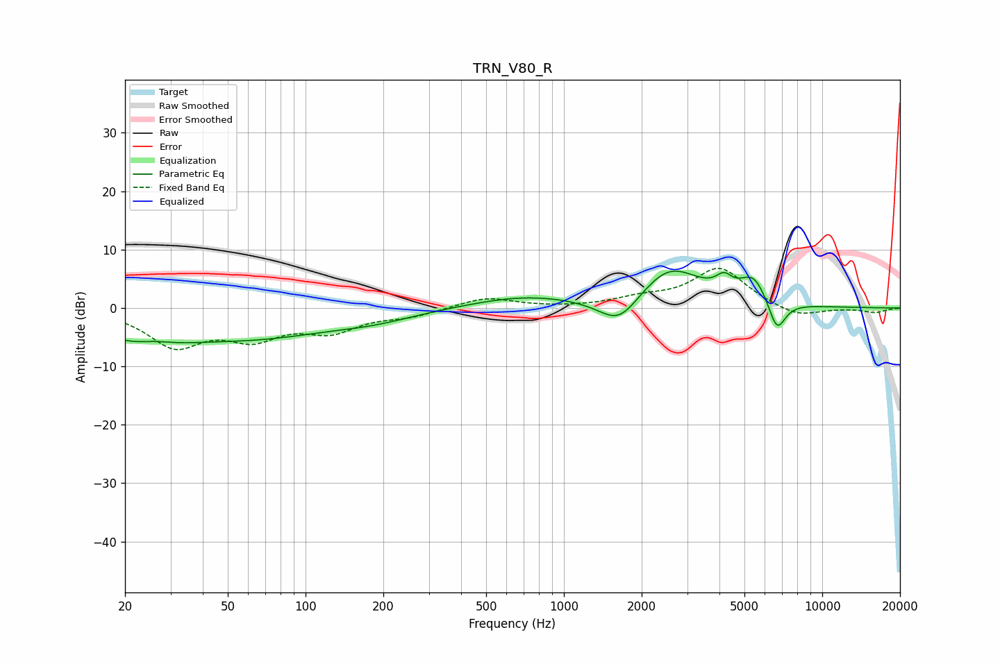

# TRN_V80_R
See [usage instructions](https://github.com/jaakkopasanen/AutoEq#usage) for more options and info.

### Parametric EQs
Apply preamp of -6.4 dB when using parametric equalizer.

|   # | Type    |   Fc (Hz) |    Q |   Gain (dB) |
|-----|---------|-----------|------|-------------|
|   1 | Peaking |        23 | 0.9  |        -5.2 |
|   2 | Peaking |        26 | 1.73 |         1.7 |
|   3 | Peaking |        64 | 0.45 |        -4.5 |
|   4 | Peaking |       186 | 0.89 |        -1.2 |
|   5 | Peaking |       702 | 0.68 |         2   |
|   6 | Peaking |      1636 | 1.74 |        -5.2 |
|   7 | Peaking |      2558 | 1.14 |         7.1 |
|   8 | Peaking |      4165 | 4.6  |         2.3 |
|   9 | Peaking |      5420 | 2.6  |         4.5 |
|  10 | Peaking |      6679 | 4.05 |        -5.6 |

### Fixed Band EQs
When using fixed band (also called graphic) equalizer, apply preamp of **-6.9 dB** (if available) and set gains manually with these parameters.

|   # | Type    |   Fc (Hz) |    Q |   Gain (dB) |
|-----|---------|-----------|------|-------------|
|   1 | Peaking |        31 | 1.41 |        -6.1 |
|   2 | Peaking |        62 | 1.41 |        -4.4 |
|   3 | Peaking |       125 | 1.41 |        -3.5 |
|   4 | Peaking |       250 | 1.41 |        -1.2 |
|   5 | Peaking |       500 | 1.41 |         1.9 |
|   6 | Peaking |      1000 | 1.41 |        -0   |
|   7 | Peaking |      2000 | 1.41 |         1.3 |
|   8 | Peaking |      4000 | 1.41 |         6.8 |
|   9 | Peaking |      8000 | 1.41 |        -1.8 |
|  10 | Peaking |     16000 | 1.41 |        -0.8 |

### Graphs

