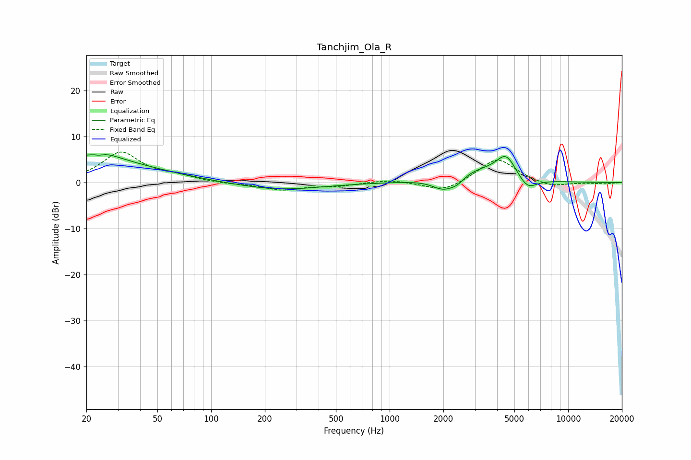

# Tanchjim_Ola_R
See [usage instructions](https://github.com/jaakkopasanen/AutoEq#usage) for more options and info.

### Parametric EQs
Apply preamp of -6.2 dB when using parametric equalizer.

|   # | Type    |   Fc (Hz) |    Q |   Gain (dB) |
|-----|---------|-----------|------|-------------|
|   1 | Peaking |        20 | 0.38 |         5   |
|   2 | Peaking |        23 | 5.97 |         2.8 |
|   3 | Peaking |        23 | 5.62 |        -3.3 |
|   4 | Peaking |        24 | 1.58 |         1.6 |
|   5 | Peaking |       239 | 0.6  |        -1.6 |
|   6 | Peaking |      2000 | 2.21 |        -2.7 |
|   7 | Peaking |      2389 | 3.19 |        -1.6 |
|   8 | Peaking |      2973 | 0.92 |         2.8 |
|   9 | Peaking |      4496 | 2.45 |         5   |
|  10 | Peaking |      5896 | 2.6  |        -2.8 |

### Fixed Band EQs
When using fixed band (also called graphic) equalizer, apply preamp of **-6.7 dB** (if available) and set gains manually with these parameters.

|   # | Type    |   Fc (Hz) |    Q |   Gain (dB) |
|-----|---------|-----------|------|-------------|
|   1 | Peaking |        31 | 1.41 |         6.5 |
|   2 | Peaking |        62 | 1.41 |         1.1 |
|   3 | Peaking |       125 | 1.41 |        -0.3 |
|   4 | Peaking |       250 | 1.41 |        -1.6 |
|   5 | Peaking |       500 | 1.41 |        -0.7 |
|   6 | Peaking |      1000 | 1.41 |         0.7 |
|   7 | Peaking |      2000 | 1.41 |        -2.2 |
|   8 | Peaking |      4000 | 1.41 |         5.4 |
|   9 | Peaking |      8000 | 1.41 |        -1.1 |
|  10 | Peaking |     16000 | 1.41 |        -0.3 |

### Graphs

