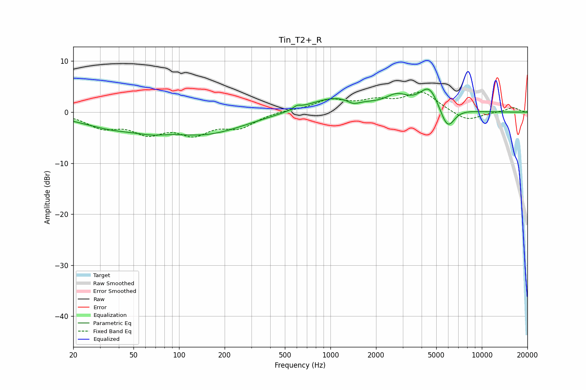

# Tin_T2+_R
See [usage instructions](https://github.com/jaakkopasanen/AutoEq#usage) for more options and info.

### Parametric EQs
Apply preamp of -4.6 dB when using parametric equalizer.

|   # | Type    |   Fc (Hz) |    Q |   Gain (dB) |
|-----|---------|-----------|------|-------------|
|   1 | Peaking |        37 | 0.65 |        -2.6 |
|   2 | Peaking |        66 | 1.51 |        -0.8 |
|   3 | Peaking |       149 | 0.53 |        -4   |
|   4 | Peaking |       601 | 5.8  |         0.6 |
|   5 | Peaking |      1080 | 0.79 |         2.9 |
|   6 | Peaking |      1418 | 3.47 |        -1   |
|   7 | Peaking |      2749 | 1.89 |         2.4 |
|   8 | Peaking |      4507 | 2.14 |         4.8 |
|   9 | Peaking |      5942 | 2.62 |        -5   |
|  10 | Peaking |      6673 | 1.76 |         0.8 |

### Fixed Band EQs
When using fixed band (also called graphic) equalizer, apply preamp of **-4.0 dB** (if available) and set gains manually with these parameters.

|   # | Type    |   Fc (Hz) |    Q |   Gain (dB) |
|-----|---------|-----------|------|-------------|
|   1 | Peaking |        31 | 1.41 |        -2.7 |
|   2 | Peaking |        62 | 1.41 |        -3.5 |
|   3 | Peaking |       125 | 1.41 |        -3.7 |
|   4 | Peaking |       250 | 1.41 |        -2.7 |
|   5 | Peaking |       500 | 1.41 |         0.3 |
|   6 | Peaking |      1000 | 1.41 |         2.2 |
|   7 | Peaking |      2000 | 1.41 |         1.8 |
|   8 | Peaking |      4000 | 1.41 |         3.8 |
|   9 | Peaking |      8000 | 1.41 |        -1.9 |
|  10 | Peaking |     16000 | 1.41 |         0.9 |

### Graphs

