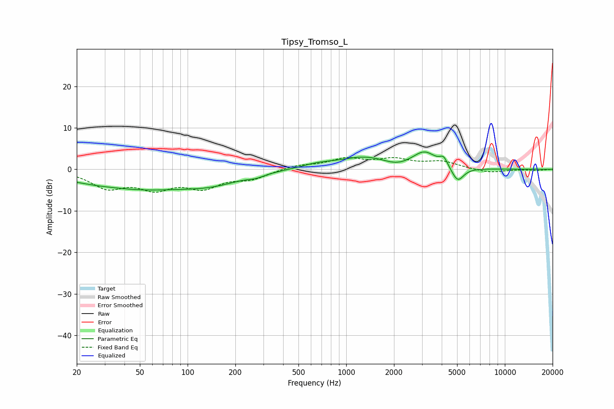

# Tipsy_Tromso_L
See [usage instructions](https://github.com/jaakkopasanen/AutoEq#usage) for more options and info.

### Parametric EQs
Apply preamp of -4.3 dB when using parametric equalizer.

|   # | Type    |   Fc (Hz) |    Q |   Gain (dB) |
|-----|---------|-----------|------|-------------|
|   1 | Peaking |        37 | 1.42 |         0.2 |
|   2 | Peaking |        46 | 0.38 |        -4.6 |
|   3 | Peaking |       145 | 0.75 |        -2.1 |
|   4 | Peaking |       270 | 3.04 |        -0.6 |
|   5 | Peaking |       659 | 1.28 |         1   |
|   6 | Peaking |      1310 | 0.91 |         2.8 |
|   7 | Peaking |      2086 | 1.77 |        -1   |
|   8 | Peaking |      3113 | 1.87 |         3.9 |
|   9 | Peaking |      4114 | 5.91 |         2   |
|  10 | Peaking |      5044 | 3.7  |        -3.6 |

### Fixed Band EQs
When using fixed band (also called graphic) equalizer, apply preamp of **-3.0 dB** (if available) and set gains manually with these parameters.

|   # | Type    |   Fc (Hz) |    Q |   Gain (dB) |
|-----|---------|-----------|------|-------------|
|   1 | Peaking |        31 | 1.41 |        -4.1 |
|   2 | Peaking |        62 | 1.41 |        -4   |
|   3 | Peaking |       125 | 1.41 |        -3.9 |
|   4 | Peaking |       250 | 1.41 |        -2   |
|   5 | Peaking |       500 | 1.41 |         1   |
|   6 | Peaking |      1000 | 1.41 |         2.3 |
|   7 | Peaking |      2000 | 1.41 |         2.1 |
|   8 | Peaking |      4000 | 1.41 |         1.7 |
|   9 | Peaking |      8000 | 1.41 |        -0.9 |
|  10 | Peaking |     16000 | 1.41 |        -0.2 |

### Graphs

