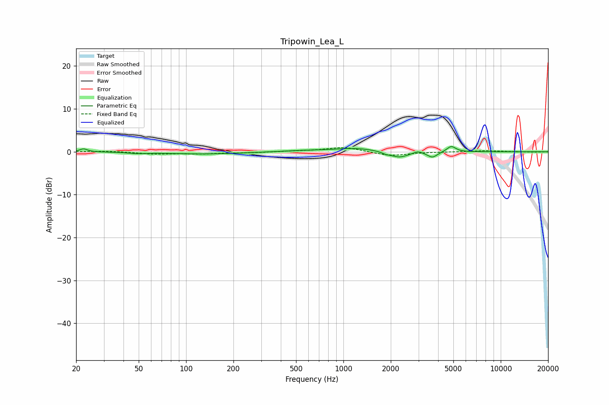

# Tripowin_Lea_L
See [usage instructions](https://github.com/jaakkopasanen/AutoEq#usage) for more options and info.

### Parametric EQs
Apply preamp of -1.3 dB when using parametric equalizer.

|   # | Type    |   Fc (Hz) |    Q |   Gain (dB) |
|-----|---------|-----------|------|-------------|
|   1 | Peaking |        22 | 5.96 |         0.7 |
|   2 | Peaking |        49 | 2.64 |        -0.3 |
|   3 | Peaking |       131 | 0.57 |        -0.5 |
|   4 | Peaking |       552 | 1.04 |         0.3 |
|   5 | Peaking |      1205 | 1.06 |         0.8 |
|   6 | Peaking |      1858 | 6    |        -0.3 |
|   7 | Peaking |      2262 | 2.32 |        -1.4 |
|   8 | Peaking |      2968 | 5.14 |         0.5 |
|   9 | Peaking |      3678 | 4.53 |        -1.3 |
|  10 | Peaking |      4847 | 5.04 |         1.4 |

### Fixed Band EQs
When using fixed band (also called graphic) equalizer, apply preamp of **-1.0 dB** (if available) and set gains manually with these parameters.

|   # | Type    |   Fc (Hz) |    Q |   Gain (dB) |
|-----|---------|-----------|------|-------------|
|   1 | Peaking |        31 | 1.41 |         0.2 |
|   2 | Peaking |        62 | 1.41 |        -0.5 |
|   3 | Peaking |       125 | 1.41 |        -0.4 |
|   4 | Peaking |       250 | 1.41 |        -0.2 |
|   5 | Peaking |       500 | 1.41 |         0.1 |
|   6 | Peaking |      1000 | 1.41 |         1.1 |
|   7 | Peaking |      2000 | 1.41 |        -1   |
|   8 | Peaking |      4000 | 1.41 |        -0   |
|   9 | Peaking |      8000 | 1.41 |         0.3 |
|  10 | Peaking |     16000 | 1.41 |        -0.1 |

### Graphs

