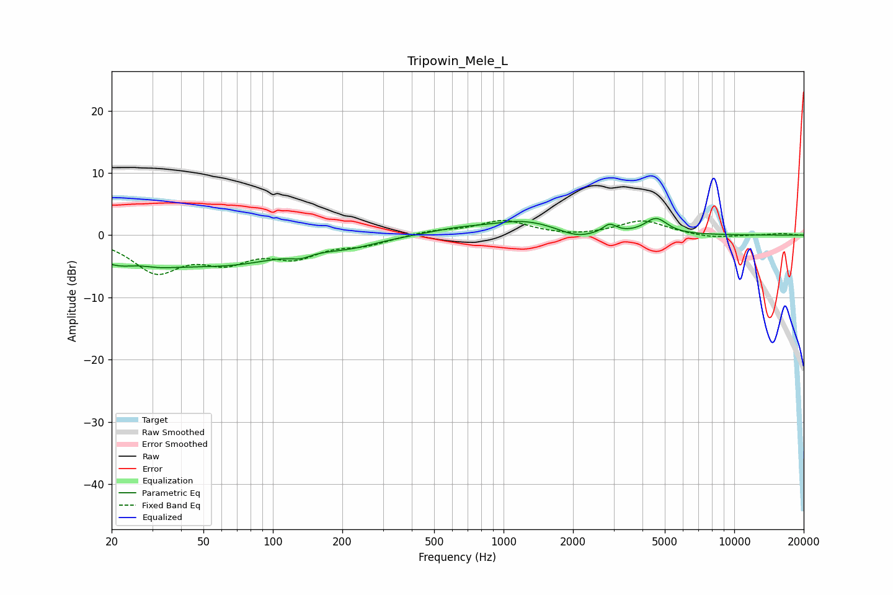

# Tripowin_Mele_L
See [usage instructions](https://github.com/jaakkopasanen/AutoEq#usage) for more options and info.

### Parametric EQs
Apply preamp of -2.8 dB when using parametric equalizer.

|   # | Type    |   Fc (Hz) |    Q |   Gain (dB) |
|-----|---------|-----------|------|-------------|
|   1 | Peaking |        24 | 0.89 |        -5   |
|   2 | Peaking |        26 | 1.96 |         1.6 |
|   3 | Peaking |        67 | 0.56 |        -3.9 |
|   4 | Peaking |       132 | 3.07 |        -0.8 |
|   5 | Peaking |       216 | 1.15 |        -1.2 |
|   6 | Peaking |       631 | 1.09 |         0.8 |
|   7 | Peaking |      1232 | 0.98 |         2.2 |
|   8 | Peaking |      2072 | 1.94 |        -1.1 |
|   9 | Peaking |      2882 | 4.94 |         1.4 |
|  10 | Peaking |      4584 | 2.89 |         2.5 |

### Fixed Band EQs
When using fixed band (also called graphic) equalizer, apply preamp of **-2.5 dB** (if available) and set gains manually with these parameters.

|   # | Type    |   Fc (Hz) |    Q |   Gain (dB) |
|-----|---------|-----------|------|-------------|
|   1 | Peaking |        31 | 1.41 |        -5.5 |
|   2 | Peaking |        62 | 1.41 |        -3.5 |
|   3 | Peaking |       125 | 1.41 |        -3.1 |
|   4 | Peaking |       250 | 1.41 |        -1.3 |
|   5 | Peaking |       500 | 1.41 |         0.7 |
|   6 | Peaking |      1000 | 1.41 |         2.3 |
|   7 | Peaking |      2000 | 1.41 |        -0.3 |
|   8 | Peaking |      4000 | 1.41 |         2.3 |
|   9 | Peaking |      8000 | 1.41 |        -0.5 |
|  10 | Peaking |     16000 | 1.41 |         0.3 |

### Graphs

