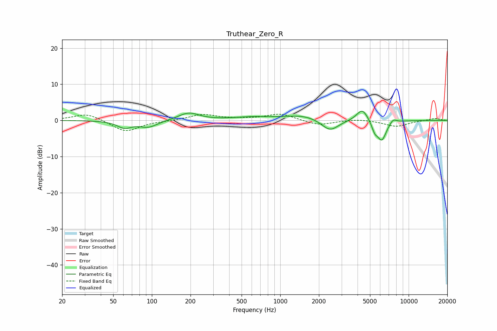

# Truthear_Zero_R
See [usage instructions](https://github.com/jaakkopasanen/AutoEq#usage) for more options and info.

### Parametric EQs
Apply preamp of -2.6 dB when using parametric equalizer.

|   # | Type    |   Fc (Hz) |    Q |   Gain (dB) |
|-----|---------|-----------|------|-------------|
|   1 | Peaking |        61 | 2.52 |        -1.9 |
|   2 | Peaking |        94 | 1.98 |        -1.8 |
|   3 | Peaking |       194 | 1.79 |         2.1 |
|   4 | Peaking |       622 | 0.9  |         0.8 |
|   5 | Peaking |      1512 | 1.03 |         1.4 |
|   6 | Peaking |      2439 | 2.12 |        -3.3 |
|   7 | Peaking |      4358 | 3.14 |         3.5 |
|   8 | Peaking |      5437 | 5.98 |        -2.2 |
|   9 | Peaking |      6177 | 3.75 |        -5.5 |
|  10 | Peaking |      7567 | 5.12 |         1.2 |

### Fixed Band EQs
When using fixed band (also called graphic) equalizer, apply preamp of **-1.8 dB** (if available) and set gains manually with these parameters.

|   # | Type    |   Fc (Hz) |    Q |   Gain (dB) |
|-----|---------|-----------|------|-------------|
|   1 | Peaking |        31 | 1.41 |         2   |
|   2 | Peaking |        62 | 1.41 |        -3.2 |
|   3 | Peaking |       125 | 1.41 |        -0.1 |
|   4 | Peaking |       250 | 1.41 |         1.6 |
|   5 | Peaking |       500 | 1.41 |         0.3 |
|   6 | Peaking |      1000 | 1.41 |         1.8 |
|   7 | Peaking |      2000 | 1.41 |        -1.4 |
|   8 | Peaking |      4000 | 1.41 |         0.4 |
|   9 | Peaking |      8000 | 1.41 |        -1.7 |
|  10 | Peaking |     16000 | 1.41 |         0.6 |

### Graphs

