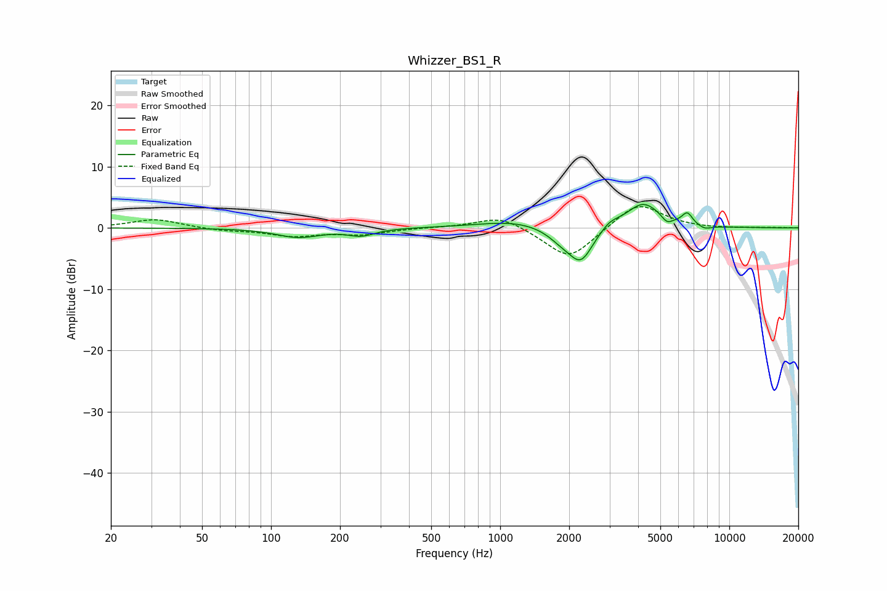

# Whizzer_BS1_R
See [usage instructions](https://github.com/jaakkopasanen/AutoEq#usage) for more options and info.

### Parametric EQs
Apply preamp of -3.9 dB when using parametric equalizer.

|   # | Type    |   Fc (Hz) |    Q |   Gain (dB) |
|-----|---------|-----------|------|-------------|
|   1 | Peaking |       132 | 1.47 |        -1.5 |
|   2 | Peaking |       248 | 2.4  |        -1.1 |
|   3 | Peaking |      1179 | 0.86 |         1.2 |
|   4 | Peaking |      1861 | 2.17 |        -1.8 |
|   5 | Peaking |      2253 | 2.62 |        -5.3 |
|   6 | Peaking |      3002 | 3.64 |         1   |
|   7 | Peaking |      4211 | 1.86 |         4.1 |
|   8 | Peaking |      5349 | 6    |        -1.1 |
|   9 | Peaking |      6555 | 5.99 |         1.9 |
|  10 | Peaking |      7812 | 4.35 |        -0.6 |

### Fixed Band EQs
When using fixed band (also called graphic) equalizer, apply preamp of **-3.6 dB** (if available) and set gains manually with these parameters.

|   # | Type    |   Fc (Hz) |    Q |   Gain (dB) |
|-----|---------|-----------|------|-------------|
|   1 | Peaking |        31 | 1.41 |         1.4 |
|   2 | Peaking |        62 | 1.41 |        -0.4 |
|   3 | Peaking |       125 | 1.41 |        -1.2 |
|   4 | Peaking |       250 | 1.41 |        -1   |
|   5 | Peaking |       500 | 1.41 |         0.1 |
|   6 | Peaking |      1000 | 1.41 |         2.1 |
|   7 | Peaking |      2000 | 1.41 |        -5.3 |
|   8 | Peaking |      4000 | 1.41 |         4.3 |
|   9 | Peaking |      8000 | 1.41 |        -0.1 |
|  10 | Peaking |     16000 | 1.41 |         0.1 |

### Graphs

