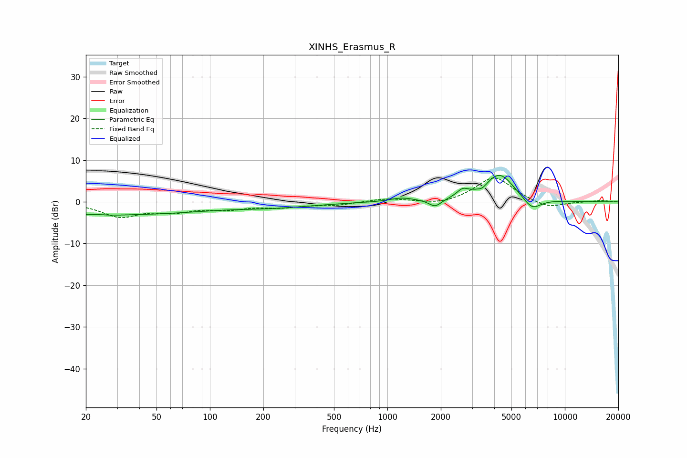

# XINHS_Erasmus_R
See [usage instructions](https://github.com/jaakkopasanen/AutoEq#usage) for more options and info.

### Parametric EQs
Apply preamp of -6.5 dB when using parametric equalizer.

|   # | Type    |   Fc (Hz) |    Q |   Gain (dB) |
|-----|---------|-----------|------|-------------|
|   1 | Peaking |        22 | 1.47 |        -3   |
|   2 | Peaking |        23 | 2.05 |         1.8 |
|   3 | Peaking |        45 | 0.42 |        -2.5 |
|   4 | Peaking |       231 | 0.62 |        -1.1 |
|   5 | Peaking |      1205 | 2.1  |         0.9 |
|   6 | Peaking |      1859 | 4.09 |        -1.8 |
|   7 | Peaking |      2654 | 4.29 |         1.7 |
|   8 | Peaking |      3430 | 6    |        -0.8 |
|   9 | Peaking |      4283 | 1.67 |         6.8 |
|  10 | Peaking |      6525 | 2.63 |        -3   |

### Fixed Band EQs
When using fixed band (also called graphic) equalizer, apply preamp of **-5.8 dB** (if available) and set gains manually with these parameters.

|   # | Type    |   Fc (Hz) |    Q |   Gain (dB) |
|-----|---------|-----------|------|-------------|
|   1 | Peaking |        31 | 1.41 |        -3.3 |
|   2 | Peaking |        62 | 1.41 |        -1.9 |
|   3 | Peaking |       125 | 1.41 |        -1.5 |
|   4 | Peaking |       250 | 1.41 |        -1.1 |
|   5 | Peaking |       500 | 1.41 |        -0.8 |
|   6 | Peaking |      1000 | 1.41 |         0.8 |
|   7 | Peaking |      2000 | 1.41 |        -0.9 |
|   8 | Peaking |      4000 | 1.41 |         6.1 |
|   9 | Peaking |      8000 | 1.41 |        -1.7 |
|  10 | Peaking |     16000 | 1.41 |         0.3 |

### Graphs

