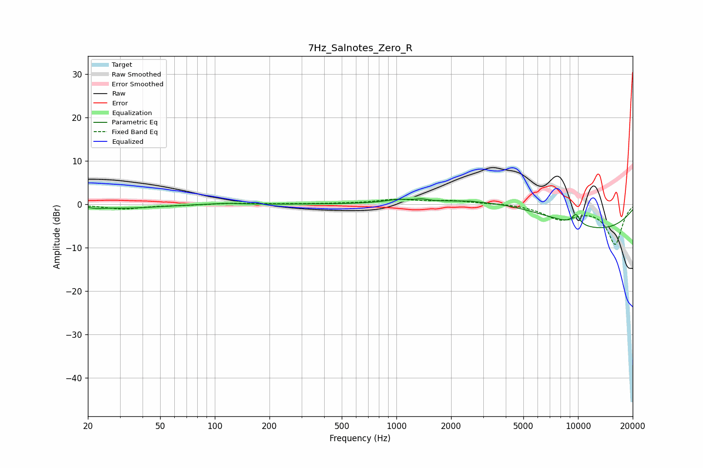

# 7Hz_Salnotes_Zero_R
See [usage instructions](https://github.com/jaakkopasanen/AutoEq#usage) for more options and info.

### Parametric EQs
Apply preamp of -1.4 dB when using parametric equalizer.

|   # | Type    |   Fc (Hz) |    Q |   Gain (dB) |
|-----|---------|-----------|------|-------------|
|   1 | Peaking |        22 | 3.44 |        -0.4 |
|   2 | Peaking |        33 | 0.85 |        -0.8 |
|   3 | Peaking |       114 | 1.68 |         0.3 |
|   4 | Peaking |      1031 | 2.03 |         0.7 |
|   5 | Peaking |      1379 | 4.55 |         0.4 |
|   6 | Peaking |      2543 | 5.38 |         0.1 |
|   7 | Peaking |      4545 | 0.4  |         5.3 |
|   8 | Peaking |      9346 | 0.27 |        -7.8 |
|   9 | Peaking |      9711 | 5.95 |         2   |
|  10 | Peaking |      9917 | 5.96 |         0.4 |

### Fixed Band EQs
When using fixed band (also called graphic) equalizer, apply preamp of **-1.3 dB** (if available) and set gains manually with these parameters.

|   # | Type    |   Fc (Hz) |    Q |   Gain (dB) |
|-----|---------|-----------|------|-------------|
|   1 | Peaking |        31 | 1.41 |        -1.1 |
|   2 | Peaking |        62 | 1.41 |        -0.2 |
|   3 | Peaking |       125 | 1.41 |         0.3 |
|   4 | Peaking |       250 | 1.41 |         0.1 |
|   5 | Peaking |       500 | 1.41 |         0.1 |
|   6 | Peaking |      1000 | 1.41 |         1   |
|   7 | Peaking |      2000 | 1.41 |         0.8 |
|   8 | Peaking |      4000 | 1.41 |         0.2 |
|   9 | Peaking |      8000 | 1.41 |        -3.2 |
|  10 | Peaking |     16000 | 1.41 |        -9.1 |

### Graphs

