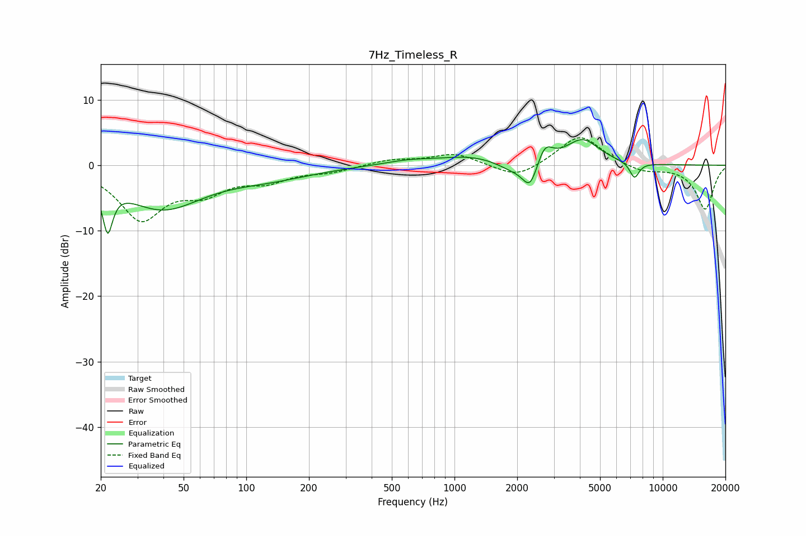

# 7Hz_Timeless_R
See [usage instructions](https://github.com/jaakkopasanen/AutoEq#usage) for more options and info.

### Parametric EQs
Apply preamp of -4.0 dB when using parametric equalizer.

|   # | Type    |   Fc (Hz) |    Q |   Gain (dB) |
|-----|---------|-----------|------|-------------|
|   1 | Peaking |        22 | 6    |        -6.9 |
|   2 | Peaking |        39 | 0.73 |        -6.4 |
|   3 | Peaking |       130 | 0.66 |        -1.6 |
|   4 | Peaking |       605 | 1.15 |         0.7 |
|   5 | Peaking |      1199 | 0.98 |         1.3 |
|   6 | Peaking |      1918 | 1.85 |        -1.3 |
|   7 | Peaking |      2308 | 3.92 |        -3.9 |
|   8 | Peaking |      2714 | 3.84 |         3   |
|   9 | Peaking |      4118 | 1.73 |         3.9 |
|  10 | Peaking |      7315 | 5.93 |        -2.4 |

### Fixed Band EQs
When using fixed band (also called graphic) equalizer, apply preamp of **-4.3 dB** (if available) and set gains manually with these parameters.

|   # | Type    |   Fc (Hz) |    Q |   Gain (dB) |
|-----|---------|-----------|------|-------------|
|   1 | Peaking |        31 | 1.41 |        -7.9 |
|   2 | Peaking |        62 | 1.41 |        -3.4 |
|   3 | Peaking |       125 | 1.41 |        -2   |
|   4 | Peaking |       250 | 1.41 |        -0.9 |
|   5 | Peaking |       500 | 1.41 |         0.8 |
|   6 | Peaking |      1000 | 1.41 |         1.8 |
|   7 | Peaking |      2000 | 1.41 |        -2.2 |
|   8 | Peaking |      4000 | 1.41 |         4.7 |
|   9 | Peaking |      8000 | 1.41 |        -1.1 |
|  10 | Peaking |     16000 | 1.41 |        -6.7 |

### Graphs

