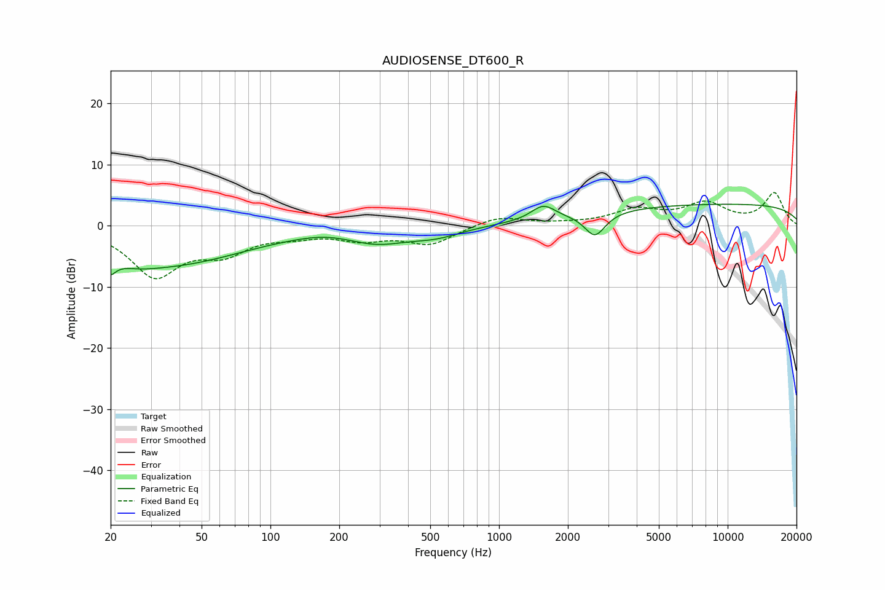

# AUDIOSENSE_DT600_R
See [usage instructions](https://github.com/jaakkopasanen/AutoEq#usage) for more options and info.

### Parametric EQs
Apply preamp of -3.6 dB when using parametric equalizer.

|   # | Type    |   Fc (Hz) |    Q |   Gain (dB) |
|-----|---------|-----------|------|-------------|
|   1 | Peaking |        20 | 5.43 |        -6   |
|   2 | Peaking |        20 | 5.67 |         3.3 |
|   3 | Peaking |        25 | 1.33 |        -1.5 |
|   4 | Peaking |        38 | 0.45 |        -5.9 |
|   5 | Peaking |       174 | 1.29 |         0.6 |
|   6 | Peaking |       294 | 1.03 |        -2.4 |
|   7 | Peaking |       533 | 1.27 |        -1.4 |
|   8 | Peaking |      1562 | 2.71 |         2.4 |
|   9 | Peaking |      2627 | 3.13 |        -3.9 |
|  10 | Peaking |      9594 | 0.18 |         3.5 |

### Fixed Band EQs
When using fixed band (also called graphic) equalizer, apply preamp of **-5.5 dB** (if available) and set gains manually with these parameters.

|   # | Type    |   Fc (Hz) |    Q |   Gain (dB) |
|-----|---------|-----------|------|-------------|
|   1 | Peaking |        31 | 1.41 |        -7.9 |
|   2 | Peaking |        62 | 1.41 |        -3.7 |
|   3 | Peaking |       125 | 1.41 |        -1.2 |
|   4 | Peaking |       250 | 1.41 |        -1.9 |
|   5 | Peaking |       500 | 1.41 |        -2.9 |
|   6 | Peaking |      1000 | 1.41 |         1.6 |
|   7 | Peaking |      2000 | 1.41 |         0.2 |
|   8 | Peaking |      4000 | 1.41 |         2.4 |
|   9 | Peaking |      8000 | 1.41 |         3.4 |
|  10 | Peaking |     16000 | 1.41 |         5.3 |

### Graphs

