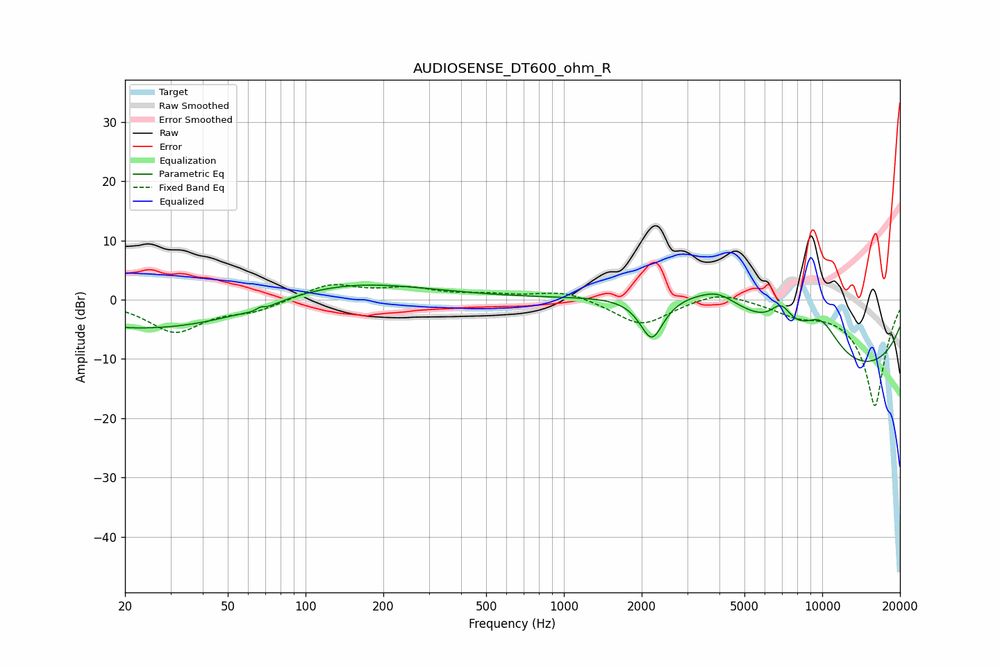

# AUDIOSENSE_DT600_ohm_R
See [usage instructions](https://github.com/jaakkopasanen/AutoEq#usage) for more options and info.

### Parametric EQs
Apply preamp of -2.6 dB when using parametric equalizer.

|   # | Type    |   Fc (Hz) |    Q |   Gain (dB) |
|-----|---------|-----------|------|-------------|
|   1 | Peaking |        36 | 0.27 |        -6.1 |
|   2 | Peaking |        67 | 5.99 |         3   |
|   3 | Peaking |        67 | 4.84 |        -3.1 |
|   4 | Peaking |       119 | 0.44 |         5.6 |
|   5 | Peaking |      2189 | 3.01 |        -7.5 |
|   6 | Peaking |      3688 | 0.4  |        12   |
|   7 | Peaking |      3956 | 2.18 |         1.5 |
|   8 | Peaking |      6928 | 3.27 |         3.8 |
|   9 | Peaking |      9010 | 0.19 |       -15.8 |
|  10 | Peaking |      9873 | 1.59 |         6.5 |

### Fixed Band EQs
When using fixed band (also called graphic) equalizer, apply preamp of **-2.7 dB** (if available) and set gains manually with these parameters.

|   # | Type    |   Fc (Hz) |    Q |   Gain (dB) |
|-----|---------|-----------|------|-------------|
|   1 | Peaking |        31 | 1.41 |        -5.3 |
|   2 | Peaking |        62 | 1.41 |        -1.7 |
|   3 | Peaking |       125 | 1.41 |         2.7 |
|   4 | Peaking |       250 | 1.41 |         1.7 |
|   5 | Peaking |       500 | 1.41 |         0.7 |
|   6 | Peaking |      1000 | 1.41 |         1.6 |
|   7 | Peaking |      2000 | 1.41 |        -4.4 |
|   8 | Peaking |      4000 | 1.41 |         1.8 |
|   9 | Peaking |      8000 | 1.41 |        -1.9 |
|  10 | Peaking |     16000 | 1.41 |       -18   |

### Graphs

