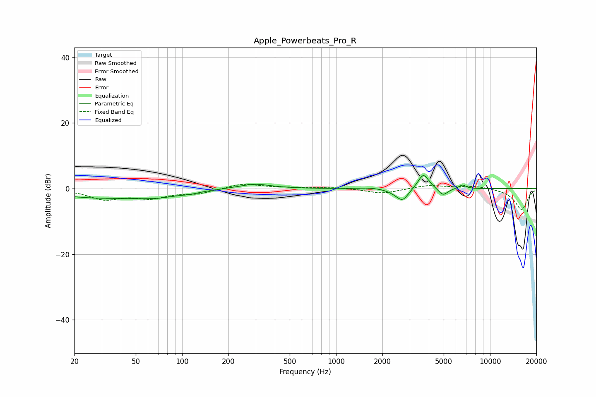

# Apple_Powerbeats_Pro_R
See [usage instructions](https://github.com/jaakkopasanen/AutoEq#usage) for more options and info.

### Parametric EQs
Apply preamp of -4.1 dB when using parametric equalizer.

|   # | Type    |   Fc (Hz) |    Q |   Gain (dB) |
|-----|---------|-----------|------|-------------|
|   1 | Peaking |        29 | 0.45 |        -2.6 |
|   2 | Peaking |        69 | 1.02 |        -1.5 |
|   3 | Peaking |       113 | 2.17 |        -0.5 |
|   4 | Peaking |       295 | 1.34 |         1.5 |
|   5 | Peaking |      1666 | 2.22 |         0.3 |
|   6 | Peaking |      2454 | 2.89 |        -0.8 |
|   7 | Peaking |      2713 | 3.75 |        -3.3 |
|   8 | Peaking |      3692 | 3.94 |         4.8 |
|   9 | Peaking |      4948 | 4.53 |        -2.3 |
|  10 | Peaking |      6616 | 6    |         1.2 |

### Fixed Band EQs
When using fixed band (also called graphic) equalizer, apply preamp of **-1.4 dB** (if available) and set gains manually with these parameters.

|   # | Type    |   Fc (Hz) |    Q |   Gain (dB) |
|-----|---------|-----------|------|-------------|
|   1 | Peaking |        31 | 1.41 |        -3   |
|   2 | Peaking |        62 | 1.41 |        -2.5 |
|   3 | Peaking |       125 | 1.41 |        -1.4 |
|   4 | Peaking |       250 | 1.41 |         1.6 |
|   5 | Peaking |       500 | 1.41 |         0.2 |
|   6 | Peaking |      1000 | 1.41 |         0.4 |
|   7 | Peaking |      2000 | 1.41 |        -1.5 |
|   8 | Peaking |      4000 | 1.41 |         1.1 |
|   9 | Peaking |      8000 | 1.41 |         0.8 |
|  10 | Peaking |     16000 | 1.41 |        -6.4 |

### Graphs

