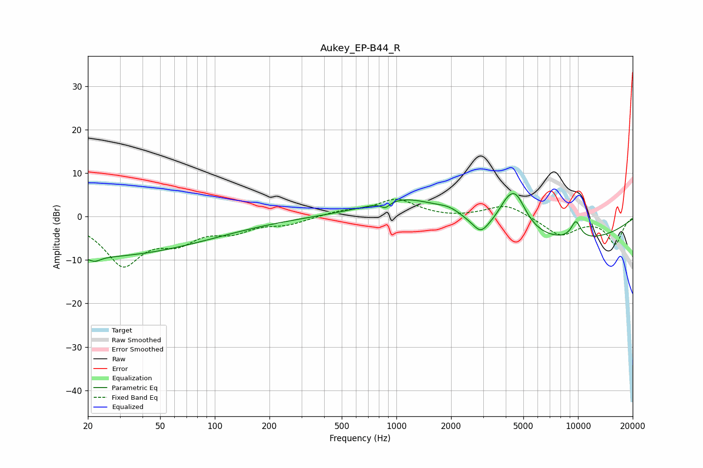

# Aukey_EP-B44_R
See [usage instructions](https://github.com/jaakkopasanen/AutoEq#usage) for more options and info.

### Parametric EQs
Apply preamp of -5.4 dB when using parametric equalizer.

|   # | Type    |   Fc (Hz) |    Q |   Gain (dB) |
|-----|---------|-----------|------|-------------|
|   1 | Peaking |        20 | 0.19 |        -9.3 |
|   2 | Peaking |        22 | 4.61 |        -1   |
|   3 | Peaking |       870 | 6    |        -1.3 |
|   4 | Peaking |      1182 | 0.67 |         5.8 |
|   5 | Peaking |      1976 | 1.83 |         2   |
|   6 | Peaking |      2913 | 3.53 |        -2.7 |
|   7 | Peaking |      4057 | 2.59 |         3.3 |
|   8 | Peaking |      4554 | 2.21 |         7.9 |
|   9 | Peaking |      6434 | 0.23 |        -6.2 |
|  10 | Peaking |      9728 | 4.44 |         4   |

### Fixed Band EQs
When using fixed band (also called graphic) equalizer, apply preamp of **-4.1 dB** (if available) and set gains manually with these parameters.

|   # | Type    |   Fc (Hz) |    Q |   Gain (dB) |
|-----|---------|-----------|------|-------------|
|   1 | Peaking |        31 | 1.41 |       -10.7 |
|   2 | Peaking |        62 | 1.41 |        -4.5 |
|   3 | Peaking |       125 | 1.41 |        -2.9 |
|   4 | Peaking |       250 | 1.41 |        -1.6 |
|   5 | Peaking |       500 | 1.41 |         1.1 |
|   6 | Peaking |      1000 | 1.41 |         3.8 |
|   7 | Peaking |      2000 | 1.41 |        -0.3 |
|   8 | Peaking |      4000 | 1.41 |         2.9 |
|   9 | Peaking |      8000 | 1.41 |        -4.3 |
|  10 | Peaking |     16000 | 1.41 |        -6.2 |

### Graphs

