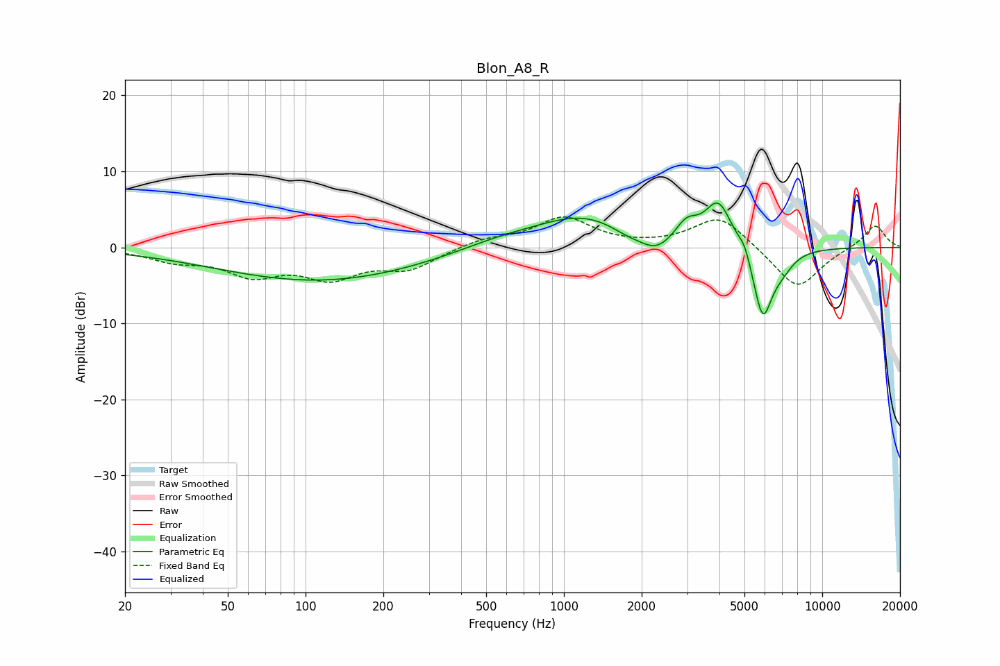

# Blon_A8_R
See [usage instructions](https://github.com/jaakkopasanen/AutoEq#usage) for more options and info.

### Parametric EQs
Apply preamp of -5.9 dB when using parametric equalizer.

|   # | Type    |   Fc (Hz) |    Q |   Gain (dB) |
|-----|---------|-----------|------|-------------|
|   1 | Peaking |       113 | 0.35 |        -4.4 |
|   2 | Peaking |       562 | 0.85 |         1.1 |
|   3 | Peaking |      1185 | 0.77 |         4   |
|   4 | Peaking |      1752 | 2.28 |        -0.8 |
|   5 | Peaking |      2268 | 2.2  |        -2.2 |
|   6 | Peaking |      2981 | 3.3  |         2.4 |
|   7 | Peaking |      3969 | 2.62 |         6   |
|   8 | Peaking |      5006 | 5.98 |         1.5 |
|   9 | Peaking |      5882 | 3.46 |        -9.5 |
|  10 | Peaking |      6995 | 2.92 |        -1.6 |

### Fixed Band EQs
When using fixed band (also called graphic) equalizer, apply preamp of **-4.1 dB** (if available) and set gains manually with these parameters.

|   # | Type    |   Fc (Hz) |    Q |   Gain (dB) |
|-----|---------|-----------|------|-------------|
|   1 | Peaking |        31 | 1.41 |        -1.5 |
|   2 | Peaking |        62 | 1.41 |        -3.2 |
|   3 | Peaking |       125 | 1.41 |        -3.5 |
|   4 | Peaking |       250 | 1.41 |        -2.6 |
|   5 | Peaking |       500 | 1.41 |         1.1 |
|   6 | Peaking |      1000 | 1.41 |         3.8 |
|   7 | Peaking |      2000 | 1.41 |         0   |
|   8 | Peaking |      4000 | 1.41 |         4.2 |
|   9 | Peaking |      8000 | 1.41 |        -5.6 |
|  10 | Peaking |     16000 | 1.41 |         3   |

### Graphs

