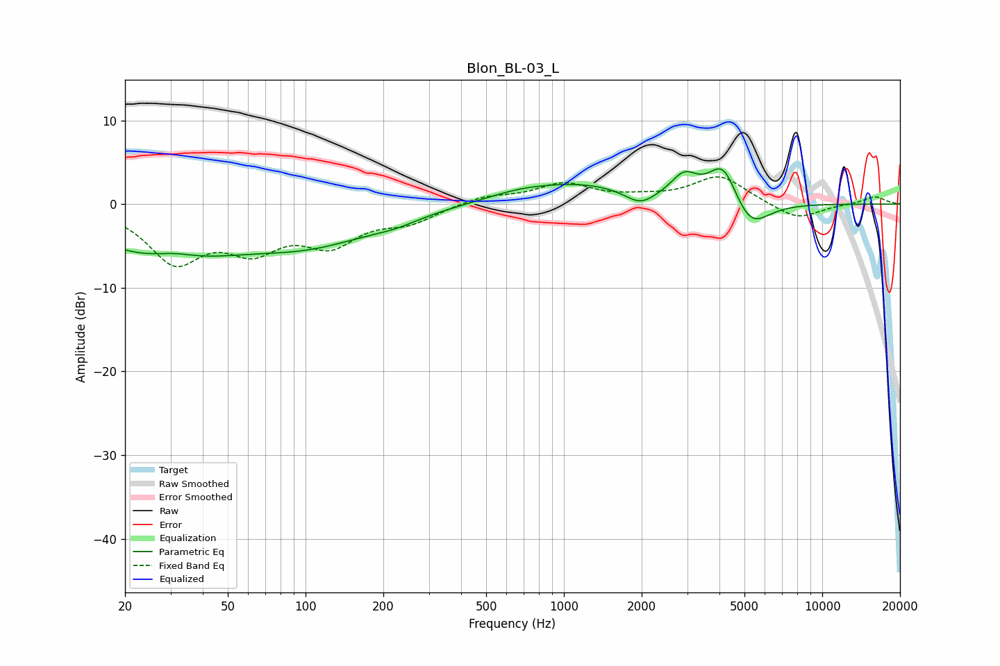

# Blon_BL-03_L
See [usage instructions](https://github.com/jaakkopasanen/AutoEq#usage) for more options and info.

### Parametric EQs
Apply preamp of -4.3 dB when using parametric equalizer.

|   # | Type    |   Fc (Hz) |    Q |   Gain (dB) |
|-----|---------|-----------|------|-------------|
|   1 | Peaking |        28 | 0.49 |        -6   |
|   2 | Peaking |        31 | 1.68 |         1   |
|   3 | Peaking |       107 | 0.56 |        -3.9 |
|   4 | Peaking |       223 | 1.52 |        -0.7 |
|   5 | Peaking |       660 | 1.18 |         0.6 |
|   6 | Peaking |      1145 | 0.61 |         2.4 |
|   7 | Peaking |      1977 | 2.37 |        -1.7 |
|   8 | Peaking |      2924 | 2.78 |         2.7 |
|   9 | Peaking |      4140 | 2.46 |         5   |
|  10 | Peaking |      5241 | 1.95 |        -3.8 |

### Fixed Band EQs
When using fixed band (also called graphic) equalizer, apply preamp of **-3.3 dB** (if available) and set gains manually with these parameters.

|   # | Type    |   Fc (Hz) |    Q |   Gain (dB) |
|-----|---------|-----------|------|-------------|
|   1 | Peaking |        31 | 1.41 |        -6.5 |
|   2 | Peaking |        62 | 1.41 |        -4.5 |
|   3 | Peaking |       125 | 1.41 |        -4.2 |
|   4 | Peaking |       250 | 1.41 |        -1.9 |
|   5 | Peaking |       500 | 1.41 |         1   |
|   6 | Peaking |      1000 | 1.41 |         2.3 |
|   7 | Peaking |      2000 | 1.41 |         0.5 |
|   8 | Peaking |      4000 | 1.41 |         3.3 |
|   9 | Peaking |      8000 | 1.41 |        -1.9 |
|  10 | Peaking |     16000 | 1.41 |         0.9 |

### Graphs

