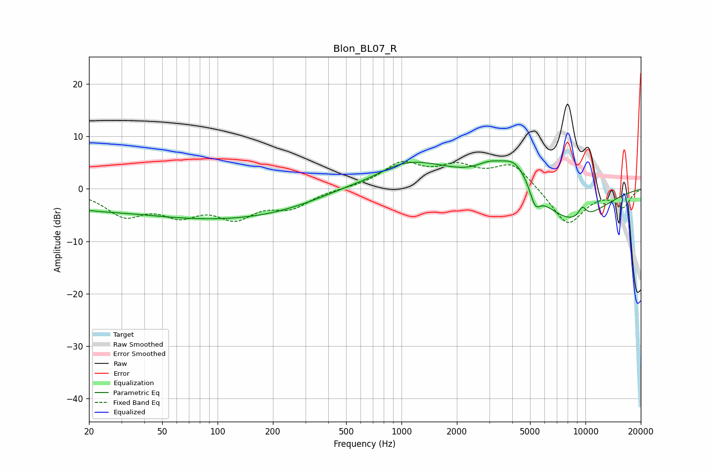

# Blon_BL07_R
See [usage instructions](https://github.com/jaakkopasanen/AutoEq#usage) for more options and info.

### Parametric EQs
Apply preamp of -5.4 dB when using parametric equalizer.

|   # | Type    |   Fc (Hz) |    Q |   Gain (dB) |
|-----|---------|-----------|------|-------------|
|   1 | Peaking |        35 | 0.66 |         0.8 |
|   2 | Peaking |        57 | 0.2  |        -5.8 |
|   3 | Peaking |       428 | 0.31 |        -1.7 |
|   4 | Peaking |       701 | 1.14 |        -1.2 |
|   5 | Peaking |      1000 | 0.53 |         7.1 |
|   6 | Peaking |      2995 | 1.92 |         2.2 |
|   7 | Peaking |      4160 | 1.58 |         5.8 |
|   8 | Peaking |      5333 | 4.96 |        -3.4 |
|   9 | Peaking |      8329 | 0.7  |        -6.7 |
|  10 | Peaking |      9619 | 5.58 |         2.1 |

### Fixed Band EQs
When using fixed band (also called graphic) equalizer, apply preamp of **-5.3 dB** (if available) and set gains manually with these parameters.

|   # | Type    |   Fc (Hz) |    Q |   Gain (dB) |
|-----|---------|-----------|------|-------------|
|   1 | Peaking |        31 | 1.41 |        -4.6 |
|   2 | Peaking |        62 | 1.41 |        -4.1 |
|   3 | Peaking |       125 | 1.41 |        -4.8 |
|   4 | Peaking |       250 | 1.41 |        -3.2 |
|   5 | Peaking |       500 | 1.41 |         0.1 |
|   6 | Peaking |      1000 | 1.41 |         4.6 |
|   7 | Peaking |      2000 | 1.41 |         3.6 |
|   8 | Peaking |      4000 | 1.41 |         4.8 |
|   9 | Peaking |      8000 | 1.41 |        -7.1 |
|  10 | Peaking |     16000 | 1.41 |        -3.3 |

### Graphs

