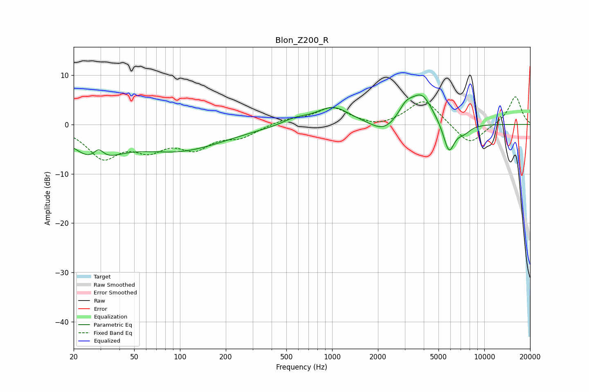

# Blon_Z200_R
See [usage instructions](https://github.com/jaakkopasanen/AutoEq#usage) for more options and info.

### Parametric EQs
Apply preamp of -6.1 dB when using parametric equalizer.

|   # | Type    |   Fc (Hz) |    Q |   Gain (dB) |
|-----|---------|-----------|------|-------------|
|   1 | Peaking |        28 | 1.02 |        -6.1 |
|   2 | Peaking |        29 | 3.98 |         2.5 |
|   3 | Peaking |        99 | 0.46 |        -5   |
|   4 | Peaking |       568 | 1.69 |         1.1 |
|   5 | Peaking |      1013 | 1.27 |         3.6 |
|   6 | Peaking |      2189 | 1.63 |        -2.3 |
|   7 | Peaking |      3054 | 2.83 |         2.7 |
|   8 | Peaking |      3889 | 1.9  |         5.9 |
|   9 | Peaking |      5855 | 3.63 |        -6.3 |
|  10 | Peaking |      7337 | 2.86 |        -1.5 |

### Fixed Band EQs
When using fixed band (also called graphic) equalizer, apply preamp of **-5.7 dB** (if available) and set gains manually with these parameters.

|   # | Type    |   Fc (Hz) |    Q |   Gain (dB) |
|-----|---------|-----------|------|-------------|
|   1 | Peaking |        31 | 1.41 |        -6.3 |
|   2 | Peaking |        62 | 1.41 |        -4.1 |
|   3 | Peaking |       125 | 1.41 |        -4.2 |
|   4 | Peaking |       250 | 1.41 |        -2.2 |
|   5 | Peaking |       500 | 1.41 |         1   |
|   6 | Peaking |      1000 | 1.41 |         3.3 |
|   7 | Peaking |      2000 | 1.41 |        -0.9 |
|   8 | Peaking |      4000 | 1.41 |         5.2 |
|   9 | Peaking |      8000 | 1.41 |        -4.4 |
|  10 | Peaking |     16000 | 1.41 |         5.8 |

### Graphs

