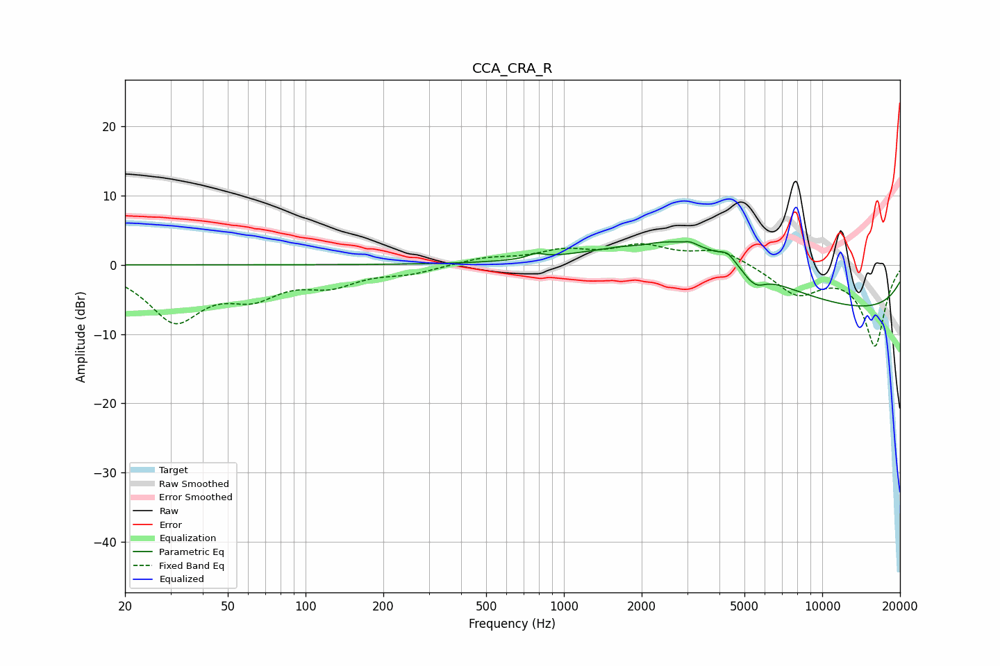

# CCA_CRA_R
See [usage instructions](https://github.com/jaakkopasanen/AutoEq#usage) for more options and info.

### Parametric EQs
Apply preamp of -3.4 dB when using parametric equalizer.

|   # | Type    |   Fc (Hz) |    Q |   Gain (dB) |
|-----|---------|-----------|------|-------------|
|   1 | Peaking |       778 | 4.76 |         0.7 |
|   2 | Peaking |      1985 | 3.12 |        -0.3 |
|   3 | Peaking |      2923 | 0.56 |         5.3 |
|   4 | Peaking |      3086 | 6    |         0.4 |
|   5 | Peaking |      3747 | 0.35 |         2.6 |
|   6 | Peaking |      4293 | 5.33 |         1.1 |
|   7 | Peaking |      5062 | 6    |        -0.2 |
|   8 | Peaking |      5477 | 5.98 |         0.7 |
|   9 | Peaking |      5489 | 4.08 |        -2.5 |
|  10 | Peaking |     10000 | 0.18 |        -7.2 |

### Fixed Band EQs
When using fixed band (also called graphic) equalizer, apply preamp of **-3.1 dB** (if available) and set gains manually with these parameters.

|   # | Type    |   Fc (Hz) |    Q |   Gain (dB) |
|-----|---------|-----------|------|-------------|
|   1 | Peaking |        31 | 1.41 |        -7.7 |
|   2 | Peaking |        62 | 1.41 |        -3.7 |
|   3 | Peaking |       125 | 1.41 |        -2.5 |
|   4 | Peaking |       250 | 1.41 |        -1.1 |
|   5 | Peaking |       500 | 1.41 |         0.9 |
|   6 | Peaking |      1000 | 1.41 |         1.8 |
|   7 | Peaking |      2000 | 1.41 |         2.5 |
|   8 | Peaking |      4000 | 1.41 |         2.2 |
|   9 | Peaking |      8000 | 1.41 |        -4.1 |
|  10 | Peaking |     16000 | 1.41 |       -11.6 |

### Graphs

