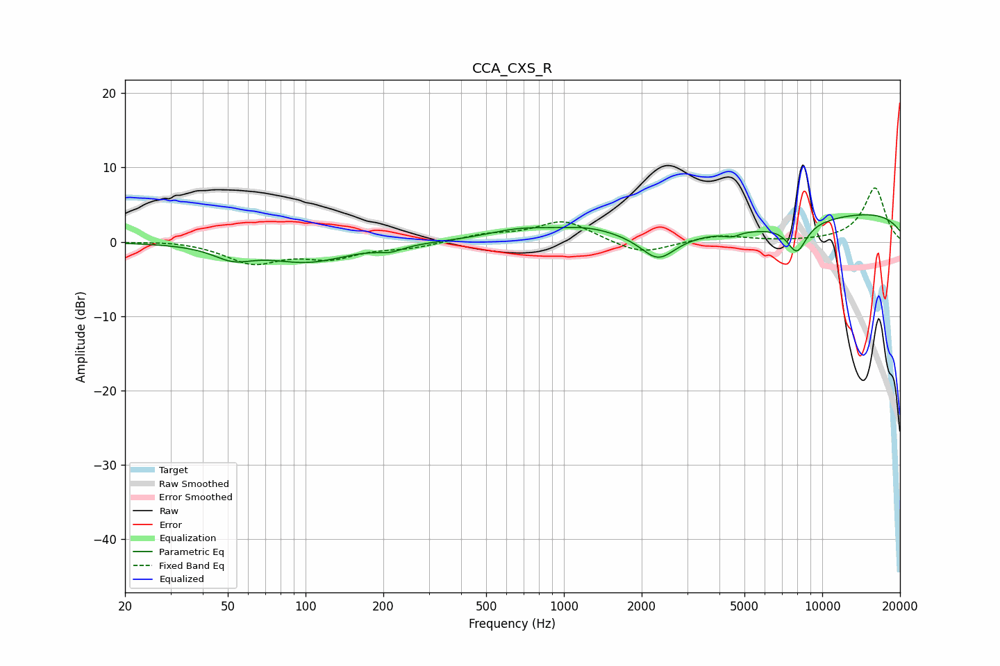

# CCA_CXS_R
See [usage instructions](https://github.com/jaakkopasanen/AutoEq#usage) for more options and info.

### Parametric EQs
Apply preamp of -3.7 dB when using parametric equalizer.

|   # | Type    |   Fc (Hz) |    Q |   Gain (dB) |
|-----|---------|-----------|------|-------------|
|   1 | Peaking |        52 | 1.87 |        -1.7 |
|   2 | Peaking |       102 | 0.91 |        -2.6 |
|   3 | Peaking |       213 | 2.89 |        -0.7 |
|   4 | Peaking |       670 | 1.07 |         1.3 |
|   5 | Peaking |      1232 | 1.07 |         1.4 |
|   6 | Peaking |      2316 | 2.11 |        -3.4 |
|   7 | Peaking |      4466 | 4.75 |        -0.6 |
|   8 | Peaking |      4672 | 0.38 |        -2.4 |
|   9 | Peaking |      7976 | 3.46 |        -3.8 |
|  10 | Peaking |      9771 | 0.18 |         4.6 |

### Fixed Band EQs
When using fixed band (also called graphic) equalizer, apply preamp of **-7.3 dB** (if available) and set gains manually with these parameters.

|   # | Type    |   Fc (Hz) |    Q |   Gain (dB) |
|-----|---------|-----------|------|-------------|
|   1 | Peaking |        31 | 1.41 |         0.3 |
|   2 | Peaking |        62 | 1.41 |        -2.7 |
|   3 | Peaking |       125 | 1.41 |        -1.9 |
|   4 | Peaking |       250 | 1.41 |        -0.7 |
|   5 | Peaking |       500 | 1.41 |         0.9 |
|   6 | Peaking |      1000 | 1.41 |         2.8 |
|   7 | Peaking |      2000 | 1.41 |        -1.8 |
|   8 | Peaking |      4000 | 1.41 |         0.9 |
|   9 | Peaking |      8000 | 1.41 |        -0   |
|  10 | Peaking |     16000 | 1.41 |         7.3 |

### Graphs

