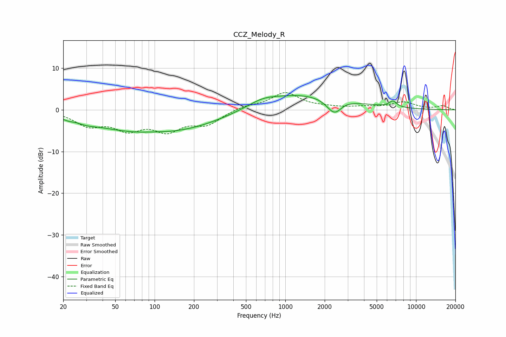

# CCZ_Melody_R
See [usage instructions](https://github.com/jaakkopasanen/AutoEq#usage) for more options and info.

### Parametric EQs
Apply preamp of -3.5 dB when using parametric equalizer.

|   # | Type    |   Fc (Hz) |    Q |   Gain (dB) |
|-----|---------|-----------|------|-------------|
|   1 | Peaking |        22 | 4.19 |        -0.3 |
|   2 | Peaking |        30 | 2.25 |        -0.6 |
|   3 | Peaking |        80 | 0.34 |        -5   |
|   4 | Peaking |       101 | 1.51 |         0.3 |
|   5 | Peaking |       261 | 0.44 |        -1.7 |
|   6 | Peaking |       669 | 1.37 |         1.1 |
|   7 | Peaking |      1303 | 0.38 |         4   |
|   8 | Peaking |      2371 | 2.38 |        -3.7 |
|   9 | Peaking |      2876 | 3.33 |         0.3 |
|  10 | Peaking |      6657 | 4.65 |         1.4 |

### Fixed Band EQs
When using fixed band (also called graphic) equalizer, apply preamp of **-4.2 dB** (if available) and set gains manually with these parameters.

|   # | Type    |   Fc (Hz) |    Q |   Gain (dB) |
|-----|---------|-----------|------|-------------|
|   1 | Peaking |        31 | 1.41 |        -3.4 |
|   2 | Peaking |        62 | 1.41 |        -4.1 |
|   3 | Peaking |       125 | 1.41 |        -4.4 |
|   4 | Peaking |       250 | 1.41 |        -3.2 |
|   5 | Peaking |       500 | 1.41 |         0.9 |
|   6 | Peaking |      1000 | 1.41 |         4   |
|   7 | Peaking |      2000 | 1.41 |         0.4 |
|   8 | Peaking |      4000 | 1.41 |         0.5 |
|   9 | Peaking |      8000 | 1.41 |         1.8 |
|  10 | Peaking |     16000 | 1.41 |         0.9 |

### Graphs

