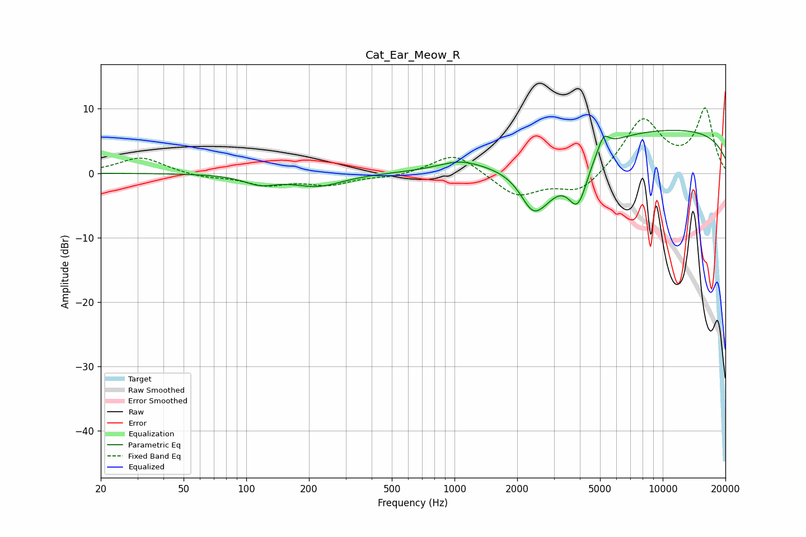

# Cat_Ear_Meow_R
See [usage instructions](https://github.com/jaakkopasanen/AutoEq#usage) for more options and info.

### Parametric EQs
Apply preamp of -6.7 dB when using parametric equalizer.

|   # | Type    |   Fc (Hz) |    Q |   Gain (dB) |
|-----|---------|-----------|------|-------------|
|   1 | Peaking |       116 | 1.83 |        -1.4 |
|   2 | Peaking |       220 | 1.16 |        -1.9 |
|   3 | Peaking |       993 | 1.33 |         0   |
|   4 | Peaking |      1056 | 1.43 |         1.3 |
|   5 | Peaking |      2352 | 2.78 |        -2.8 |
|   6 | Peaking |      2599 | 1.38 |        -6.8 |
|   7 | Peaking |      3891 | 2.88 |        -7.1 |
|   8 | Peaking |      4172 | 5.58 |        -0.4 |
|   9 | Peaking |      5197 | 5.38 |         2.4 |
|  10 | Peaking |      9731 | 0.18 |         6.9 |

### Fixed Band EQs
When using fixed band (also called graphic) equalizer, apply preamp of **-10.2 dB** (if available) and set gains manually with these parameters.

|   # | Type    |   Fc (Hz) |    Q |   Gain (dB) |
|-----|---------|-----------|------|-------------|
|   1 | Peaking |        31 | 1.41 |         2.5 |
|   2 | Peaking |        62 | 1.41 |        -0.6 |
|   3 | Peaking |       125 | 1.41 |        -1.7 |
|   4 | Peaking |       250 | 1.41 |        -1.6 |
|   5 | Peaking |       500 | 1.41 |        -0.6 |
|   6 | Peaking |      1000 | 1.41 |         3.3 |
|   7 | Peaking |      2000 | 1.41 |        -3.6 |
|   8 | Peaking |      4000 | 1.41 |        -3.2 |
|   9 | Peaking |      8000 | 1.41 |         8.4 |
|  10 | Peaking |     16000 | 1.41 |         9.8 |

### Graphs

