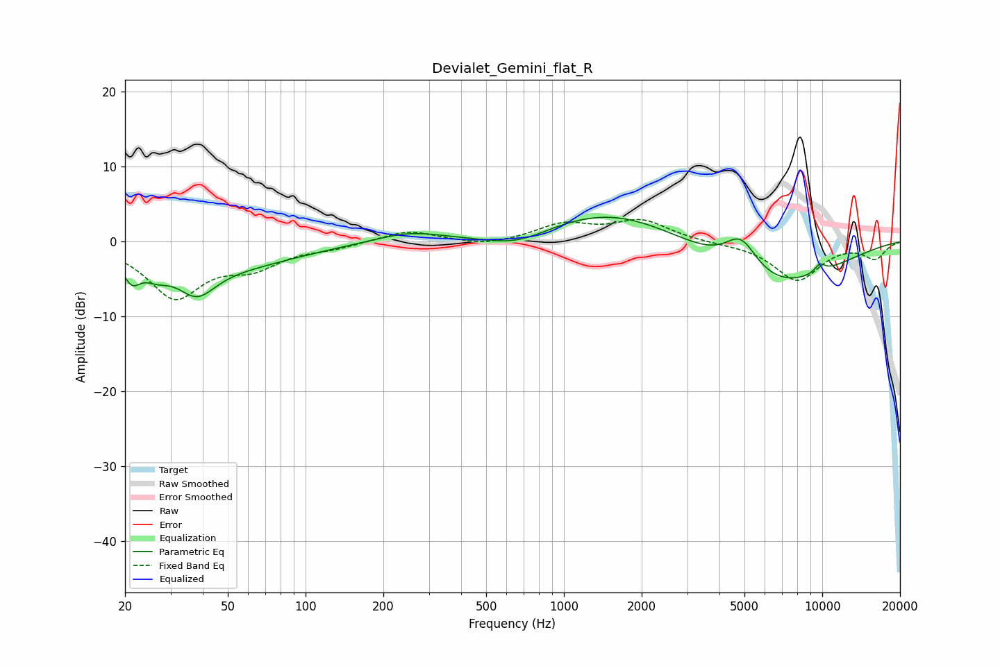

# Devialet_Gemini_flat_R
See [usage instructions](https://github.com/jaakkopasanen/AutoEq#usage) for more options and info.

### Parametric EQs
Apply preamp of -3.3 dB when using parametric equalizer.

|   # | Type    |   Fc (Hz) |    Q |   Gain (dB) |
|-----|---------|-----------|------|-------------|
|   1 | Peaking |        21 | 4.15 |        -3.2 |
|   2 | Peaking |        26 | 2.61 |        -2   |
|   3 | Peaking |        38 | 1.88 |        -4.5 |
|   4 | Peaking |        55 | 0.58 |        -2.9 |
|   5 | Peaking |       251 | 1.1  |         1.3 |
|   6 | Peaking |       659 | 1.1  |        -2   |
|   7 | Peaking |      1539 | 0.52 |         4.5 |
|   8 | Peaking |      4847 | 2.17 |         4.7 |
|   9 | Peaking |      6430 | 0.54 |        -6.6 |
|  10 | Peaking |      9787 | 5.76 |         1.2 |

### Fixed Band EQs
When using fixed band (also called graphic) equalizer, apply preamp of **-3.0 dB** (if available) and set gains manually with these parameters.

|   # | Type    |   Fc (Hz) |    Q |   Gain (dB) |
|-----|---------|-----------|------|-------------|
|   1 | Peaking |        31 | 1.41 |        -7.3 |
|   2 | Peaking |        62 | 1.41 |        -2.9 |
|   3 | Peaking |       125 | 1.41 |        -0.7 |
|   4 | Peaking |       250 | 1.41 |         1.5 |
|   5 | Peaking |       500 | 1.41 |        -0.7 |
|   6 | Peaking |      1000 | 1.41 |         2.2 |
|   7 | Peaking |      2000 | 1.41 |         2.7 |
|   8 | Peaking |      4000 | 1.41 |        -0.2 |
|   9 | Peaking |      8000 | 1.41 |        -5.2 |
|  10 | Peaking |     16000 | 1.41 |        -2.2 |

### Graphs

