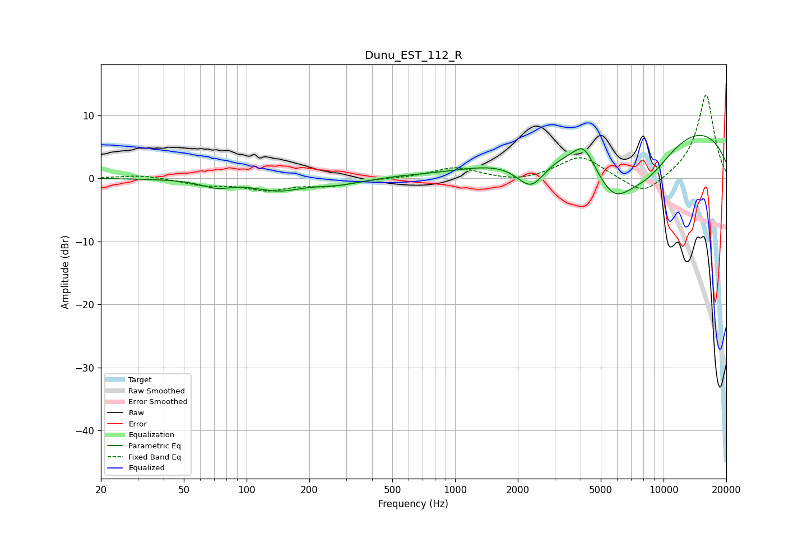

# Dunu_EST_112_R
See [usage instructions](https://github.com/jaakkopasanen/AutoEq#usage) for more options and info.

### Parametric EQs
Apply preamp of -6.9 dB when using parametric equalizer.

|   # | Type    |   Fc (Hz) |    Q |   Gain (dB) |
|-----|---------|-----------|------|-------------|
|   1 | Peaking |        72 | 1.91 |        -1.2 |
|   2 | Peaking |       142 | 1.23 |        -1.7 |
|   3 | Peaking |       277 | 1.23 |        -0.9 |
|   4 | Peaking |       538 | 1.45 |         0.1 |
|   5 | Peaking |      1274 | 2.17 |        -0   |
|   6 | Peaking |      2315 | 1.91 |        -5.2 |
|   7 | Peaking |      4141 | 2.94 |         3.1 |
|   8 | Peaking |      5755 | 1.3  |        -7.9 |
|   9 | Peaking |      8364 | 0.88 |        -6.9 |
|  10 | Peaking |      9121 | 0.21 |        10.2 |

### Fixed Band EQs
When using fixed band (also called graphic) equalizer, apply preamp of **-13.3 dB** (if available) and set gains manually with these parameters.

|   # | Type    |   Fc (Hz) |    Q |   Gain (dB) |
|-----|---------|-----------|------|-------------|
|   1 | Peaking |        31 | 1.41 |         0.6 |
|   2 | Peaking |        62 | 1.41 |        -1   |
|   3 | Peaking |       125 | 1.41 |        -1.7 |
|   4 | Peaking |       250 | 1.41 |        -1   |
|   5 | Peaking |       500 | 1.41 |        -0   |
|   6 | Peaking |      1000 | 1.41 |         1.7 |
|   7 | Peaking |      2000 | 1.41 |        -0.7 |
|   8 | Peaking |      4000 | 1.41 |         3.6 |
|   9 | Peaking |      8000 | 1.41 |        -3   |
|  10 | Peaking |     16000 | 1.41 |        13.5 |

### Graphs

